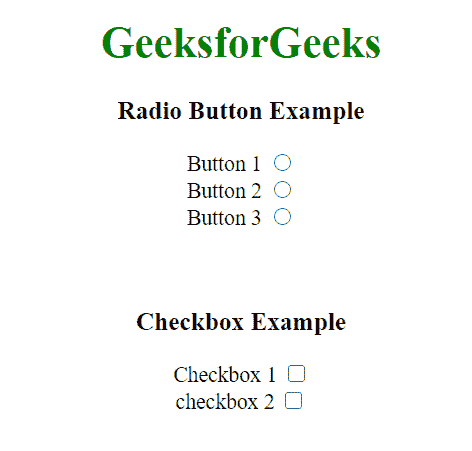

# jQuery UI checkbox radio disable()方法

> 原文:[https://www . geesforgeks . org/jquery-ui-checkbox radio-disable-method/](https://www.geeksforgeeks.org/jquery-ui-checkboxradio-disable-method/)

Checkboxradio Widget disable()方法用于禁用 Checkboxradio 按钮功能。此方法不接受任何参数。

**语法:**

```
$( ".selector" ).checkboxradio( "disable" );
```

**方法:**首先，添加项目所需的 jQuery UI 脚本。

> <link href="“https://code.jquery.com/ui/1.10.4/themes/ui-lightness/jquery-ui.css”" rel="“stylesheet”">

**示例:**

## 超文本标记语言

```
<!DOCTYPE html>
<html>

<head>
    <link href=
'https://ajax.googleapis.com/ajax/libs/jqueryui/1.12.1/themes/cupertino/jquery-ui.css'
        rel='stylesheet'>

    <script src=
        "https://ajax.googleapis.com/ajax/libs/jquery/3.1.1/jquery.min.js">
    </script>

    <script src=
        "https://ajax.googleapis.com/ajax/libs/jqueryui/1.12.1/jquery-ui.min.js">
    </script>
</head>

<body>
    <center>
        <h1 style="color:green">GeeksforGeeks</h1>

        <h3>Radio Button Example</h3>
        <label for="radio1">Button 1</label>
        <input type="radio" name="radio" 
            id="radio1" class='radio'>
        <br>

        <label for="radio2">Button 2</label>
        <input type="radio" name="radio" 
            id="radio2" class='radio'>
        <br>

        <label for="radio3">Button 3</label>
        <input type="radio" name="radio" 
            id="radio3" class='radio'>
        <br><br><br>

        <h3>Checkbox Example</h3>
        <label for="checkbox1">Checkbox 1</label>
        <input type="checkbox" name="checkbox1" 
            id="checkbox1" class='checkbox'>
        <br>

        <label for="checkbox2">checkbox 2</label>
        <input type="checkbox" name="checkbox2" 
            id="checkbox2" class='checkbox'>

        <script>
            $(document).ready(function () {

                $(".radio, .checkbox").checkboxradio("disable");
            }); 
        </script>
    </center>
</body>

</html>
```

**输出:**

