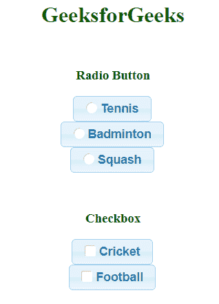
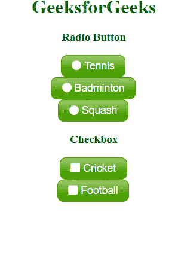

# jquery ui check box radio widget

> 哎哎哎:# t0]https://www . geeksforgeeks . org/jquery-ui-checkbox radio widget/

checkboxradio 小部件可用于接收用户的输入。传统的 checkboxradio 单选按钮和 jQuery 用户界面中的按钮之间的主要区别是它可以轻松地风格化按钮。通过将相关标签放置在隐藏输入的顶部，并使用一个(可选的)图标模拟复选框或单选元素本身，这个小部件可以解决这个限制。

**语法:**

```
$( "$selector" ).checkboxradio({
});
```

**属性:**

*   **销毁:**用于移除 jQuery UI 的 checkboxradio 功能，改为标准复选框，没有任何样式。
*   **禁用:**禁用复选框单选按钮。
*   **启用:**启用复选框单选按钮(如果之前已禁用)。
*   **实例:**返回复选框的最后一个实例对象如果没有选择对象，则返回*未定义*。
*   **刷新:**用于刷新小部件的外观，在更改和应用不同主题后有用。
*   **小部件:**返回完整的 checkboxradio 作为 jQuery 小部件对象。

**示例 1:** 让我们创建一个带有基本主题的简单复选框收音机，下面是它的代码。

```
<!DOCTYPE html>
<html>

<head>
    <link href=
'https://ajax.googleapis.com/ajax/libs/jqueryui/1.12.1/themes/cupertino/jquery-ui.css' 
          rel='stylesheet'>

    <script src=
"https://ajax.googleapis.com/ajax/libs/jquery/3.1.1/jquery.min.js">
  </script>
    <script src=
"https://ajax.googleapis.com/ajax/libs/jqueryui/1.12.1/jquery-ui.min.js">
  </script>
</head>

<body>
    <center>
        <h1 style="color:green">GeeksforGeeks</h1>
        <br>
        <h3>Radio Button</h3>
        <label for="radio-1">Tennis</label>
        <input type="radio" 
               name="radio-1" 
               id="radio-1"
               class='r2'>
        <br>
        <label for="radio-2">Badminton</label>
        <input type="radio" 
               name="radio-1"
               id="radio-2"
               class='r2'>
        <br>
        <label for="radio-3">Squash</label>
        <input type="radio"
               name="radio-1" 
               id="radio-3" 
               class='r2'>
        <br>
        <br>
        <br>

        <h3>Checkbox</h3>
        <label for="checkbox-1">Cricket</label>
        <input type="checkbox" 
               name="checkbox-1" 
               id="checkbox-1" 
               class='c2'>
        <br>
        <label for="checkbox-2">Football</label>
        <input type="checkbox"
               name="checkbox-2"
               id="checkbox-2" 
               class='c2'>

        <script>
            $(document).ready(function() {

                $(".r2, .c2").checkboxradio({});

            });
        </script>
  </center>
</body>

</html>
```

**输出:**


**应用主题:**可以通过改变 CSS 文件来改变主题。这里，jQuery UI 中已经使用了一些预定义的 CSS 文件。头部标签内部调用的 CSS 文件中的更改。

**例 2:**

```
<!DOCTYPE html>
<html>

<head>
    <link href=
'https://ajax.googleapis.com/ajax/libs/jqueryui/1.12.1/themes/cupertino/jquery-ui.css'
          rel='stylesheet'>
    <link rel='stylesheet'
          href=
'https://ajax.googleapis.com/ajax/libs/jqueryui/1.12.1/themes/le-frog/jquery-ui.css'>
    <script src=
"https://ajax.googleapis.com/ajax/libs/jquery/3.1.1/jquery.min.js">
  </script>
    <script src=
"https://ajax.googleapis.com/ajax/libs/jqueryui/1.12.1/jquery-ui.min.js">
  </script>
</head>

<body>
    <center>
        <h1 style="color:green">GeeksforGeeks</h1>
        <h3>Radio Button</h3>
        <label for="radio-1">Tennis</label>
        <input type="radio" 
               name="radio-1"
               id="radio-1" 
               class='r2'>
        <br>
        <label for="radio-2">Badminton</label>
        <input type="radio" 
               name="radio-1" 
               id="radio-2"
               class='r2'>
        <br>
        <label for="radio-3">Squash</label>
        <input type="radio"
               name="radio-1" 
               id="radio-3" 
               class='r2'>
        <br>
        <h3>Checkbox</h3>
        <label for="checkbox-1">Cricket</label>
        <input type="checkbox" 
               name="checkbox-1" 
               id="checkbox-1"
               class='c2'>
        <br>
        <label for="checkbox-2">Football</label>
        <input type="checkbox" 
               name="checkbox-2" 
               id="checkbox-2" 
               class='c2'>

        <script>
            $(document).ready(function() {
                $(".r2, .c2").checkboxradio({});

            });
        </script>
    </center>
</body>

</html>
```

**注意:**在上例中 *r2* 和 *c2* 是 div 标签的 id。要将其应用于某个类，请添加*“{ content } ”;*类名前。

**例:**“$ my _ class”
这里我们用了主题*“勒-蛙”*。正如这一行所规定的。

> <link rel="’stylesheet’" href="’https://ajax.googleapis.com/ajax/libs/jqueryui/1.12.1/themes/le-frog/jquery-ui.css’">

**输出:**
