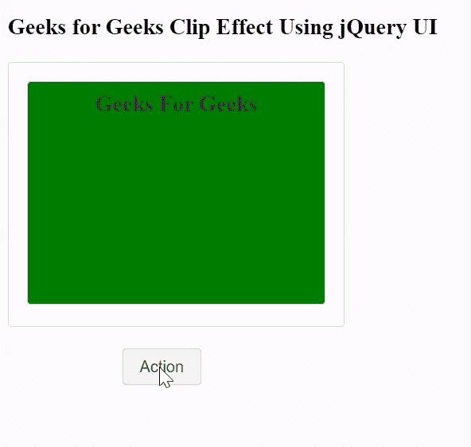

# jQuery UI 剪辑效果

> 原文:[https://www.geeksforgeeks.org/jquery-ui-clip-effect/](https://www.geeksforgeeks.org/jquery-ui-clip-effect/)

在本文中，我们将使用 jQuery UI 展示**剪辑**效果。当点击*动作*按钮，实际触发剪辑效果脚本时，所有内容将同时从顶部和底部消失。

**语法:**

```html
$( ".selector" ).effect( 
    selectedEffect, options, time(in ms), callback 
);
```

**参数:**

*   **选择效果:**开发者在 jQuery UI 中给出的选择效果。
*   **选项:**增加了某些功能(可选)。
*   **时间:**完成效果的时间以微秒计。
*   **回调:**增加了某些功能(可选)。

**返回值:**不返回值。

**添加的脚本:**请下载包含预编译文件的库用于代码实现，或者使用下面给定脚本的路径。

> <link rel="”stylesheet”" href="”//code.jquery.com/ui/1.12.1/themes/base/jquery-ui.css”">

**示例:**在本例中，我们将使用 jQuery UI 展示**剪辑**效果。我们将使用一个按钮触发脚本。

## 超文本标记语言

```html
<!doctype html>
<html lang="en">

<head>
    <meta charset="utf-8">
    <meta name="viewport" content=
        "width=device-width, initial-scale=1">

    <link rel="stylesheet" href=
"//code.jquery.com/ui/1.12.1/themes/base/jquery-ui.css">

    <script src=
        "https://code.jquery.com/jquery-1.12.4.js">
    </script>

    <script src=
        "https://code.jquery.com/ui/1.12.1/jquery-ui.js">
    </script>

    <script>
        $(function () {
            function action(selectedEffect) {
                $("#effect").effect(selectedEffect, 1200);
            };
            $("#button").on("click", function () {
                action("clip");
                return false;
            });
        });
    </script>

    <style>
        .animation {
            width: 500px;
            height: 500px;
            position: absolute;
        }

        #button {
            padding: .5em 1em;
            text-decoration: none;
            position: absolute;
        }

        #effect {
            width: 250px;
            height: 190px;
            padding: 15px;
            position: relative;
        }
    </style>
</head>

<body>
    <h3>
        Geeks for Geeks Clip 
        Effect Using jQuery UI
    </h3>

    <div class="animation">
        <div id="effect" class=
            "ui-widget-content ui-corner-all">

            <h3 class="ui-widget-header ui-corner-all"
                style="margin: 0; padding: 0.4em;
                    height: 170px; text-align: center;
                    background-color: green;">
                Geeks For Geeks
            </h3>
        </div>
    </div>

    <span style="margin-left: 6em;">
        <button id="button" class=
            "ui-state-default ui-corner-all" 
            style="margin-top: 18em;">
            Action
        </button>
    </span>
</body>

</html>
```

**输出:**

