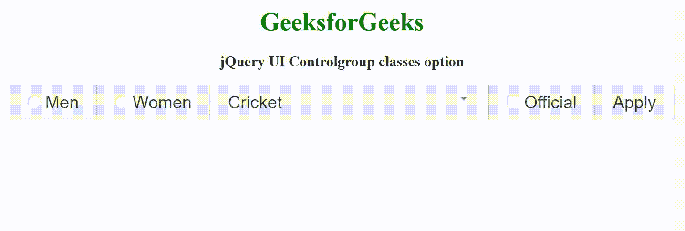

# jquery ui control group classes option

> 原文:[https://www . geesforgeks . org/jquery-ui-control group-class-option/](https://www.geeksforgeeks.org/jquery-ui-controlgroup-classes-option/)

jQuery UI 由 GUI 小部件、视觉效果和使用 jQuery、CSS 和 HTML 实现的主题组成。jQuery 用户界面非常适合为网页构建用户界面。jQuery UI 控件组类选项用于添加一些额外的类，以将样式添加到控件组元素中。

**语法:**

```
$( ".selector" ).controlgroup({
  classes: {
    "ui-controlgroup": "highlight"
  }
});
```

**CDN 链接:**首先，添加项目所需的 jQuery UI 脚本。

> <link rel="”stylesheet”" href="”//code.jquery.com/ui/1.12.1/themes/smoothness/jquery-ui.css”">
> <脚本 src =//code . jquery . com/jquery-1 . 12 . 4 . js "></脚本>
> <脚本 src =//code . jquery . com/ui/1 . 12 . 1/jquery-ui . js "></脚本>

**示例:**

## 超文本标记语言

```
<!DOCTYPE html>
<html lang="en">

<head>
    <meta charset="utf-8">
    <link rel="stylesheet" href=
    "//code.jquery.com/ui/1.12.1/themes/base/jquery-ui.css">
    <script src="https://code.jquery.com/jquery-1.12.4.js">
    </script>
    <script src="https://code.jquery.com/ui/1.12.1/jquery-ui.js">
    </script>
    <style>
        .highlight,
        label {
            font-size: 22px;
        }
    </style>
    <script>
        $(document).ready(function () {
            $(".my_games_control_group").controlgroup({
                classes: {
                    "ui-controlgroup": "highlight"
                }
            });
        });
    </script>
</head>

<body style="text-align: center;">
    <h1 style="color:green">GeeksforGeeks</h1>
    <h3>jQuery UI Controlgroup classes option</h3>

    <div class="my_games_control_group">
        <label for="radio_1">Men</label>
        <input type="radio" name="type" id="radio_1">
        <label for="radio_2">Women</label>
        <input type="radio" name="type" id="radio_2">
        <select>
            <option>Cricket</option>
            <option>Hockey</option>
            <option>Tennis</option>
            <option>Football</option>
        </select>
        <label for="official">Official</label>
        <input type="checkbox" name="official" id="official">
        <button id="apply">Apply</button>
    </div>
</body>

</html>
```

**输出:**



**参考:**[https://API . jquery ui . com/control group/# option-classes](https://api.jqueryui.com/controlgroup/#option-classes)