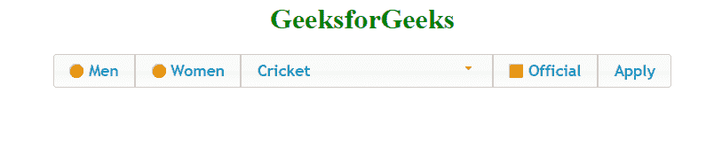
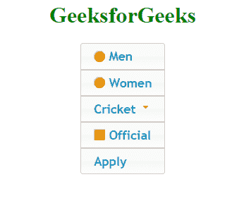
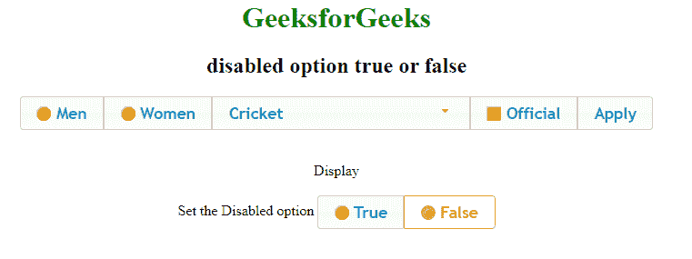
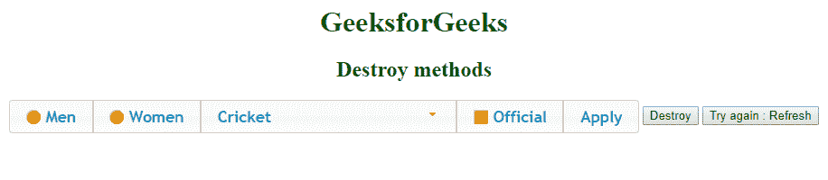

# jquery ui | control group widget

> 哎哎哎:# t0]https://www . geeksforgeeks . org/jquery-ui-control group widget/

控件组用于对各种输入小部件进行分组，如复选框、按钮等。控件组有助于将公共属性应用于表单的所有元素。例如，如果用户声明当前地址与永久地址相同，那么我们可以禁用用于输入永久地址的部分。Controlgroup 通过选择适当的后代并应用它们各自的小部件来工作。如果小部件已经存在，则调用它们的 refresh()方法。可以启用和禁用控制组，这将启用和禁用所有包含的小部件。

**语法:**

```html
$( ".my_games_control_group" ).controlgroup({
});
```

**属性:**

*   **销毁:**用于从代码中删除控制组功能。
*   **禁用:**用于禁用控制组。
*   **启用:**用于启用之前禁用的控制组。
*   **实例:**返回当前对象的实例。
*   **选项:**返回当前与指定选项名称关联的值。
*   **刷新:**用于处理任何添加或删除的小部件。
*   **小部件:**返回包含整个控件组的对象。

让我们创建一个简单的基本控件组，它有一个单选按钮、一个下拉列表、一个复选框、一个标签和一个按钮。为此，我们在类中指定小部件，并在脚本标签中的 javascript 代码中提到类名。

**例 1:**

```html
<!DOCTYPE html>
<html>

<head>
    <link href=
'https://ajax.googleapis.com/ajax/libs/jqueryui/1.12.1/themes/ui-lightness/jquery-ui.css'
          rel='stylesheet'>
</head>

<body>
<center>
  <h1 style="color:green">GeeksforGeeks</h1>
    <div class="my_games_control_group">

        <label for="radio_1">Men</label>
        <input type="radio" name="type" id="radio_1">
        <label for="radio_2">Women</label>
        <input type="radio" name="type" id="radio_2">
        <select>
            <option>Cricket</option>
            <option>Hockey</option>
            <option>Tennis</option>
            <option>Football</option>
        </select>
        <label for="official">Official</label>
        <input type="checkbox"
               name="official" 
               id="official">
        <button id="apply">Apply</button>
    </div>

    <script src=
"https://ajax.googleapis.com/ajax/libs/jquery/3.1.1/jquery.min.js">
  </script>
    <script src=
"https://ajax.googleapis.com/ajax/libs/jqueryui/1.12.1/jquery-ui.min.js">
  </script>

    <script>
        $(document).ready(function() {

            $(".my_games_control_group").controlgroup({});

        })
    </script>
  </center>
</body>

</html>
```

**输出:**


**改变控制组的方向/方向:**可以通过在**“方向”**选项中指定来改变控制组的方向。默认情况下，它设置为水平，可用于将方向更改为垂直。

**例 2:**

```html
<!DOCTYPE html>
<html>

<head>
    <link href=
'https://ajax.googleapis.com/ajax/libs/jqueryui/1.12.1/themes/ui-lightness/jquery-ui.css'
          rel='stylesheet'>
</head>

<body>
    <center>
        <h1 style="color:green">GeeksforGeeks</h1>
        <div class="my_games_control_group">

            <label for="radio_1">Men</label>
            <input type="radio" name="type" id="radio_1">
            <label for="radio_2">Women</label>
            <input type="radio" name="type" id="radio_2">
            <select>
                <option>Cricket</option>
                <option>Hockey</option>
                <option>Tennis</option>
                <option>Football</option>
            </select>
            <label for="official">Official</label>
            <input type="checkbox" name="official" id="official">
            <button id="apply">Apply</button>
        </div>

        <script src=
"https://ajax.googleapis.com/ajax/libs/jquery/3.1.1/jquery.min.js">
      </script>
        <script src=
"https://ajax.googleapis.com/ajax/libs/jqueryui/1.12.1/jquery-ui.min.js">
      </script>

        <script>
            $(document).ready(function() {

                $(".my_games_control_group").controlgroup({
                    "direction": "vertical"
                });

            })
        </script>
     </center>
</body>

</html>
```

**输出:**


**启用/禁用控制组:**将**禁用**选项设置为**真**以禁用控制组。默认情况下，该值为 false。在下面的代码中，添加了另一个带有两个单选按钮的控件组，这将启用或禁用主控件组。这还会显示禁用控件组的代码。

**例 3:**

```html
<!DOCTYPE html>
<html>

<head>
    <link href=
'https://ajax.googleapis.com/ajax/libs/jqueryui/1.12.1/themes/ui-lightness/jquery-ui.css' 
          rel='stylesheet'>
</head>

<body>
    <center>
        <h1 style="color:green">GeeksforGeeks</h1>
        <h2>disabled option true or false</h2>
        <div class="my_games_control_group">

            <label for="radio_1">Men</label>
            <input type="radio" name="type" id="radio_1">
            <label for="radio_2">Women</label>
            <input type="radio" name="type" id="radio_2">
            <select>
                <option>Cricket</option>
                <option>Hockey</option>
                <option>Tennis</option>
                <option>Football</option>
            </select>
            <label for="official">Official</label>
            <input type="checkbox" name="official" id="official">
            <button id="apply">Apply</button>
        </div>
        <br><br><br>

        <div id=display>Display</div>
        <br> Set the Disabled option
        <div class='radio_selection'>
            <label for=sel_radio_1>True</label>
            <input type='radio'
                   name='r_disabled' 
                   id='sel_radio_1' 
                   value=true>
            <label for=sel_radio_2>False</label>
            <input type='radio' 
                   name='r_disabled'
                   id='sel_radio_2' 
                   value=false 
                   checked>
        </div>

        <script src=
"https://ajax.googleapis.com/ajax/libs/jquery/3.1.1/jquery.min.js">
      </script>
        <script src=
"https://ajax.googleapis.com/ajax/libs/jqueryui/1.12.1/jquery-ui.min.js">
      </script>

        <script>
            $(document).ready(function() {

                $(".my_games_control_group, .radio_selection").controlgroup()

                $("input:radio[name=r_disabled]").click(function() {
                    var selection = ($(this).val() == 'true');
                    $(".my_games_control_group").controlgroup(
                      "option", "disabled", selection);
                    $('#display').html(
" $( \".my_games_control_group\" ).controlgroup( \"option\", \"disabled\", "
                      + selection + ")");
                })

            })
        </script>
    </center>
</body>

</html>
```

**输出:**


**销毁控制组:**要销毁控制组，请使用销毁方法。这个方法会破坏 controlgroup，完全移除它的功能，并将包含的所有小部件返回到初始化前的状态。下面代码中使用的销毁方法是通过一个按钮的点击事件，有另一个按钮重新加载页面再试一次。

**例 4:**

```html
<!DOCTYPE html>
<html>

<head>
    <link href=
'https://ajax.googleapis.com/ajax/libs/jqueryui/1.12.1/themes/ui-lightness/jquery-ui.css'
          rel='stylesheet'>
</head>

<body>
    <center>
        <h1 style="color:green">GeeksforGeeks</h1>
        <h2>Destroy methods</h2>
        <div class="my_games_control_group">

            <label for="radio_1">Men</label>
            <input type="radio" name="type" id="radio_1">
            <label for="radio_2">Women</label>
            <input type="radio" name="type" id="radio_2">
            <select>
                <option>Cricket</option>
                <option>Hockey</option>
                <option>Tennis</option>
                <option>Football</option>
            </select>
            <label for="official">Official</label>
            <input type="checkbox" name="official" id="official">
            <button id="apply">Apply</button>
        </div>

        <button id=my_button>Destroy</button>
        <a href=''>
            <button type='button'>Try again : Refresh</button>
        </a>

        <script src=
"https://ajax.googleapis.com/ajax/libs/jquery/3.1.1/jquery.min.js">
      </script>
        <script src=
"https://ajax.googleapis.com/ajax/libs/jqueryui/1.12.1/jquery-ui.min.js">
      </script>

        <script>
            $(document).ready(function() {

                $(".my_games_control_group").controlgroup({})

                $('#my_button').click(function() {
                    $(".my_games_control_group").controlgroup("destroy");
                })
            })
        </script>
    </center>
</body>

</html>
```

**输出:**
