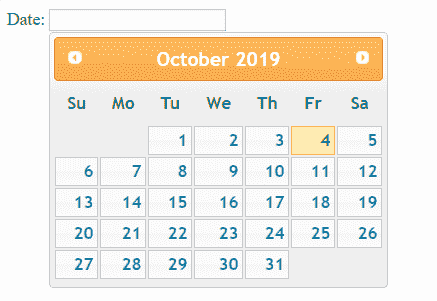
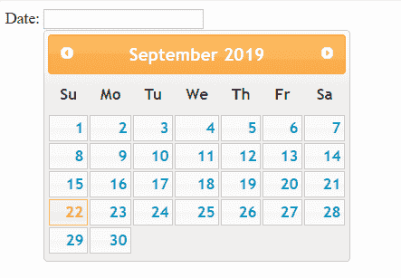
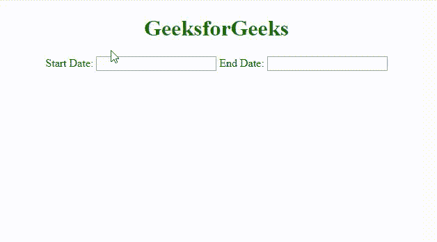

# jQuery UI |日期选择器

> 哎哎哎:# t0]https://www . geeksforgeeks . org/jquery-ui-date picker/

jQuery 用户界面的日期选择器用于向用户提供日历，以便从日历中选择日期。这个日期选择器通常连接到一个文本框，因此用户从日历中选择的日期可以转移到文本框中。

我们将为不同的库和样式使用 CDN 链接。要显示任何 jQuery UI 小部件，我们必须使用 jQuery 和 jQuery UI 的链接。我们还将使用 style 属性，并在我们的日历中使用了 Cupertino 主题。您可以更改主题以符合您的风格要求。

> <link href="’https://ajax.googleapis.com/ajax/libs/jqueryui/1.12.1/themes/ui-lightness/jquery-ui.css’" rel="’stylesheet’">

**示例 1:** 本示例显示一个日期选择器。

```html
<!DOCTYPE html>
<html>

<head>
    <title>
        jQuery UI | Date Picker
    </title>

    <link href=
'https://ajax.googleapis.com/ajax/libs/jqueryui/1.12.1/themes/ui-lightness/jquery-ui.css'
          rel='stylesheet'>

    <script src=
"https://ajax.googleapis.com/ajax/libs/jquery/3.1.1/jquery.min.js" >
    </script>

    <script src=
"https://ajax.googleapis.com/ajax/libs/jqueryui/1.12.1/jquery-ui.min.js" >
    </script>
</head>

<body>
    Date: <input type="text" id="my_date_picker">

    <script>
        $(document).ready(function() {

            $(function() {
                $( "#my_date_picker" ).datepicker();
            });
        })
    </script>
</body>

</html>
```

**输出:**


**默认选择日期:**默认日历中选择今天的日期。但是，我们可以通过为默认日期赋值来更改默认日期。

**例 2:**

```html
<!DOCTYPE html>
<html>

<head>
    <title>
        jQuery UI | Date Picker
    </title>

    <link href=
'https://ajax.googleapis.com/ajax/libs/jqueryui/1.12.1/themes/
ui-lightness/jquery-ui.css'
        rel='stylesheet'>

    <script src=
"https://ajax.googleapis.com/ajax/libs/jquery/3.1.1/jquery.min.js" >
    </script>

    <script src=
"https://ajax.googleapis.com/ajax/libs/jqueryui/1.12.1/jquery-ui.min.js" >
    </script>
</head>

<body>
    Date: <input type="text" id="my_date_picker">

    <script>
        $(function() {
            $( "#my_date_picker" ).datepicker({
                defaultDate:"09/22/2019"
            });
        });
    </script>
</body>

</html>
```

**输出:**


**管理日期格式:**在显示日历的同时，我们可以管理日期格式。我们可以在脚本部分使用下面的 jQuery 代码来获得结果。

```html
<script>
$(function() {
    $( "#my_date_picker" ).datepicker({
        dateFormat: 'dd-mm-yy',
        defaultDate:"24-09-2019"
    });
});
</script>
```

**管理工作日:**默认情况下，从周日开始显示一周的第一天(第一天=0)。我们可以通过更改 firstDay 的值来更改开始日期。

```html
<script>
$(function() {
    $( "#my_date_picker" ).datepicker({
        firstDay:2 // Tuesday is first day
    });
});
</script>
```

**更新月和年:**根据我们的需求，我们可以添加选项供用户选择月和年。

```html
<script>
$(function() {
    $( "#my_date_picker" ).datepicker({
        changeMonth: true,
        changeYear: true
    });
});
</script>
```

**要选择的最大和最小日期:**我们可以通过分配最大和最小日期值来限制用户从日历中选择日期。

```html
$(function() {
    $( "#my_date_picker" ).datepicker({
        maxDate:'+3d',
        minDate: '-4d'
    });
});
```

我们有两个日历，一个日历是选择开始日期，另一个是选择日历中的结束日期。它可以用于酒店预订，我们必须选择入住日期和退房日期。此类安排必须满足以下条件。

*   选择开始日期后，结束日期不能早于开始日期
*   选择结束日期后，开始日期不能晚于结束日期
*   结束日期不能更改为开始日期之前
*   开始日期不能更改为结束日期之后。
*   在上述情况下，不能选择的日期应禁止选择。

## 互锁两个约会者

在使用两个互锁日历之前，我们将学习如何设置最小可选日期和最大可选日期。
**日期:**最小可选日期。**最大日期:**最大可选日期。在关于日期选择器的上一篇文章的末尾有一个例子。又来了。

两个日历的互锁
**日历的变化功能:**
我们将使用变化功能来触发事件。每当启动日历的更改功能被触发时，我们将为结束日历设置*提醒*。
同样，当触发结束日历的任何更改功能时，我们将设置开始日历的最大日期。
***getDate()***
此方法返回日历的选定日期。这里有一个例子

```html
var my_date = $( "#my_calendar" ).datepicker( "getDate" );
```

我们将使用它来获取用户选择的日期。
现在我们给用户两个日历，选择开始日期和结束日期。

```html
<!DOCTYPE html>
<html>

<head>
    <link href=
'https://ajax.googleapis.com/ajax/libs/jqueryui/1.12.1/themes/ui-lightness/jquery-ui.css' 
          rel='stylesheet'>
    <style>
        .ui-datepicker {
            width: 12em; 
        }
        h1{
            color:green;
        }
    </style>
</head>

<body>
    <center>
        <h1>GeeksforGeeks</h1> 
          Start Date:
        <input type="text" id="my_date_picker1"> 
          End Date:
        <input type="text" id="my_date_picker2">
        <script src=
"https://ajax.googleapis.com/ajax/libs/jquery/3.1.1/jquery.min.js">
        </script>
        <script src=
"https://ajax.googleapis.com/ajax/libs/jqueryui/1.12.1/jquery-ui.min.js">
        </script>
        <script>
            $(document).ready(function() {

                $(function() {
                    $("#my_date_picker1").datepicker({});
                });

                $(function() {
                    $("#my_date_picker2").datepicker({});
                });

                $('#my_date_picker1').change(function() {
                    startDate = $(this).datepicker('getDate');
                    $("#my_date_picker2").datepicker("option", "minDate", startDate);
                })

                $('#my_date_picker2').change(function() {
                    endDate = $(this).datepicker('getDate');
                    $("#my_date_picker1").datepicker("option", "maxDate", endDate);
                })
            })
        </script>
    </center>
</body>

</html>
```

**输出:**


jQuery 是一个开源的 JavaScript 库，它简化了 HTML/CSS 文档之间的交互，它以其“少写多做”的理念而闻名。
跟随本 [jQuery 教程](https://www.geeksforgeeks.org/jquery-tutorials/)和 [jQuery 示例](https://www.geeksforgeeks.org/jquery-examples/)可以从头开始学习 jQuery。