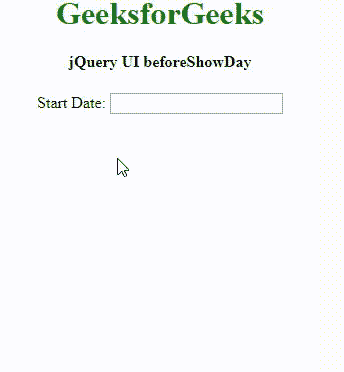

# jquery ui date picker beforeshowday option

> 原文:[https://www . geeksforgeeks . org/jquery-ui-date picker-beforeshowday-option/](https://www.geeksforgeeks.org/jquery-ui-datepicker-beforeshowday-option/)

显示日之前的 jQuery 用户界面**是[日期选择器](https://www.geeksforgeeks.org/jquery-ui-date-picker/)中的一个选项。通过使用这个选项，我们可以通过每天使用来调用任何函数。这在显示日历之前执行。**

**我们不希望用户选择某些日期(假设当天的所有票都售罄)，那么我们可以应用此选项并禁用用户选择的日期。 **beforeShowDay** 通过将每天作为参数传递来运行函数。我们将在代码中使用 CDN 链接来添加不同的库和样式。要像其他 jQuery UI 小部件一样显示这个函数，我们必须链接到 jQuery 和 jQuery UI。将此代码复制到您的 HTML 文件中，通过 CDN(内容交付网络)将我们的文件链接到 jquery 和 jquery UI。这里我们使用了谷歌的 CDN，但是你也可以使用 jquery 或者微软的 CDN**

> <link href="’https://ajax.googleapis.com/ajax/libs/jqueryui/1.12.1/themes/ui-lightness/jquery-ui.css’rel=’stylesheet’">

**让我们用 javascript 创建一个数组，其中包含不可用的日期元素。在下文中，代码 9/12/2019 和 13/12/2019 不可用，而其余日期可用。我们使用了函数 **beforeShowDay:my_check** 来执行 javascript 代码，根据数组中提到的日期返回 True 或 False。在显示日历之前，每天都通过这个函数，并根据返回值显示日期。**

****例 1:****

```
<!DOCTYPE html>
<html>
<head>
    <link href=
'https://ajax.googleapis.com/ajax/libs/jqueryui/1.12.1/themes/ui-lightness/jquery-ui.css' 
         rel='stylesheet'>
    <script src=
"https://ajax.googleapis.com/ajax/libs/jquery/3.1.1/jquery.min.js">
    </script>
    <script src=
"https://ajax.googleapis.com/ajax/libs/jqueryui/1.12.1/jquery-ui.min.js">

    </script>
    <style>
        h1{
            color:green;
        }
        .ui-datepicker {
            width: 12em;
        }

    </style>
</head>

<body>
    <center>
        <h1>GeeksforGeeks</h1>
        <h4>jQuery UI beforeShowDay</h4>
    Start Date:
    <input type="text" id="my_date_picker1">
    <script>
        $(document).ready(function() {
            ////////
            $(function() {
                $("#my_date_picker1").datepicker({
                    dateFormat: 'dd-mm-yy',
                    defaultDate: "02-12-2019",
                    beforeShowDay: my_check

                });
            });

            function my_check(in_date) {
                in_date = in_date.getDate() + '/'
                + (in_date.getMonth() + 1) + '/' + in_date.getFullYear();
                var my_array = new Array('9/12/2019', '13/12/2019');
                //$('#d1').append(in_date+'<br>')
                if (my_array.indexOf(in_date) >= 0) {
                    return [false, "notav", 'Not Available'];
                } else {
                    return [true, "av", "available"];
                }
            }
        })
    </script>

</body>
</html>
```

****输出:**
**

****封锁特定日期:**我们可以选择封锁日历中的特定工作日。这将永久禁用工作日，并使其在任何一周都不可选择。整个日历。在下面的例子中，我们选择禁用**周日**。**

****例 2:****

```
<!DOCTYPE html>
<html>

<head>
    <link href=
'https://ajax.googleapis.com/ajax/libs/jqueryui/1.12.1/themes/ui-lightness/jquery-ui.css'
          rel='stylesheet'>
    <script src=
"https://ajax.googleapis.com/ajax/libs/jquery/3.1.1/jquery.min.js">
    </script>
    <script src=
"https://ajax.googleapis.com/ajax/libs/jqueryui/1.12.1/jquery-ui.min.js">
    </script>
    <style>
        h1 {
            color: green;
        }

        .ui-datepicker {
            width: 12em;
        }
    </style>
</head>

<body>
    <center>
        <h1>GeeksforGeeks</h1>
        <h4>jQuery UI beforeShowDay</h4> Start Date:
        <input type="text" id="my_date_picker1">
        <script>
            $(document).ready(function() {
                $(function() {
                    $("#my_date_picker1").datepicker({
                        dateFormat: 'dd-mm-yy',
                        beforeShowDay: my_check
                    });
                });

                function my_check(in_date) {
                    if (in_date.getDay() == 0) {
                        return [false, "notav", 'Not Available'];
                    } else {
                        return [true, "av", "available"];
                    }
                }
            })
        </script>
   </center>
</body>

</html>
```

****输出:**
**

****更复杂的过滤:**现在我们将尝试过滤掉所有第二个星期六以及所有星期天。我们可以通过使用下面的代码来做到这一点。
**确定第二个星期六**以下是在任何给定月份确定第二个星期六背后的逻辑。首先，我们确定一个月的第一天及其工作日(周日为 0，周一为 1，依此类推..)14-(每月第一天的工作日号码)给出了每月第二个星期六的日期。下面的代码中使用了类似的逻辑。**

****例 3:****

```
<!DOCTYPE html>
<html>
<head>
    <link href=
'https://ajax.googleapis.com/ajax/libs/jqueryui/1.12.1/themes/ui-lightness/jquery-ui.css' 
          rel='stylesheet'>
    <script src=
"https://ajax.googleapis.com/ajax/libs/jquery/3.1.1/jquery.min.js">
    </script>
    <script src=
"https://ajax.googleapis.com/ajax/libs/jqueryui/1.12.1/jquery-ui.min.js">
    </script>
    <style>
        h1 {
            color: green;
        }

        .ui-datepicker {
            width: 12em;
        }
    </style>
</head>

<body>
    <center>
        <h1>GeeksforGeeks</h1>
        <h4>jQuery UI beforeShowDay</h4> Start Date:
        <input type="text" id="my_date_picker1">
        <div id=d1></div>
        <script>
            $(document).ready(function() {
                $(function() {
                    $("#my_date_picker1").datepicker({
                        dateFormat: 'dd-mm-yy',
                        beforeShowDay: my_check
                    });
                });

                function my_check(in_date) {
                    var firstDay = new Date(in_date.getFullYear(), 
                                               in_date.getMonth(), 1);
                    var saturday2 = 14 - firstDay.getDay()
                    if (in_date.getDay() == 0 || 
                                      in_date.getDate() == saturday2) {
                        return [false, "notav", 'Not Available'];
                    } else {
                        return [true, "av", "available"];
                    }
                }

            })
        </script>
    </center>
</body>

</html>
```

****输出:**
**

**同样，我们也可以禁用第二个和第四个星期六。下面是禁用星期日、第二个星期六和第四个星期六的代码。**

```
function my_check(in_date) {
            var firstDay = new Date(in_date.getFullYear(), in_date.getMonth(), 1);
            var saturday2 = 14 - firstDay.getDay()
            var saturday4 = 28 - firstDay.getDay()
            if (in_date.getDay() == 0 || in_date.getDate() == saturday2 
                                      || in_date.getDate() == saturday4) {
                return [false, "notav", 'Not Available'];
            } else {
                return [true, "av", "available"];
            }
```