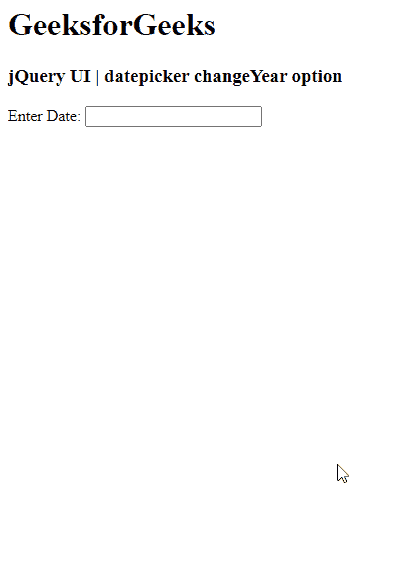

# jquery ui date picker change year option

> 哎哎哎:# t0]https://www . geeksforgeeks . org/jquery-ui-date picker-change year 选项/

jQuery UI 由 GUI 小部件、视觉效果和使用 jQuery、CSS 和 HTML 实现的主题组成。jQuery 用户界面非常适合为网页构建用户界面。jquery yui 中的 jQueryUI Datepickers 小部件允许用户轻松直观地输入日期。在本文中，我们将看到如何在 jQuery UI 日期选择器中使用 **changeYear 选项**。**更改年份选项**用于在 jQuery 用户界面日期选择器中直接更改年份。

**语法:**

```html
$(".selector").datepicker(
   {changeYear:true }
);
```

**进场:**

*   首先，添加项目所需的 jQuery UI 脚本。

> <link href="“https://code.jquery.com/ui/1.10.4/themes/ui-lightness/jquery-ui.css”" rel="“stylesheet”">

**示例:**

## 超文本标记语言

**输出:**



参考:https://API . jquery ui . com/date picker/