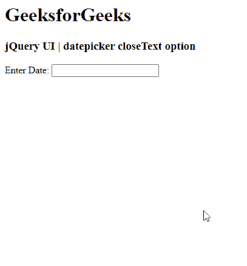

# jQuery UI Datepicker closeText 选项

> 哎哎哎:# t0]https://www . geeksforgeeks . org/jquery-ui-date picker-closeetext 选项/

jQuery UI 由 GUI 小部件、视觉效果和使用 jQuery、CSS 和 HTML 实现的主题组成。jQuery 用户界面非常适合为网页构建用户界面。jQuery UI Datepickers 小部件允许用户轻松直观地输入日期。在本文中，我们将看到如何在 jQuery UI Datepicker 中使用 **closeText** 选项。**关闭文本**选项用于仅通过单击 jQuery 用户界面日期选择器中的文本来关闭日期选择器。

**语法:**

```html
$(".selector").datepicker(
   {closeText: 'tap',
    showButtonPanel: true}
);
```

**进场:**

*   首先，添加项目所需的 jQuery UI 脚本。

> <link href="“https://code.jquery.com/ui/1.10.4/themes/ui-lightness/jquery-ui.css”" rel="“stylesheet”">

**示例:**

## 超文本标记语言

```html
<!doctype html>
<html lang = "en">
   <head>
      <meta charset = "utf-8">
      <link href =
        "https://code.jquery.com/ui/1.10.4/themes/ui-lightness/jquery-ui.css"
         rel = "stylesheet">
      <script src =
         "https://code.jquery.com/jquery-1.10.2.js">
      </script>
      <script src =
         "https://code.jquery.com/ui/1.10.4/jquery-ui.js">
      </script>

      <!-- Javascript -->
      <script>

         $(function() {
            $( "#gfg" ).datepicker(
                {closeText: 'tap',
                showButtonPanel: true}
            );
         });
      </script>
   </head>
       <h1>GeeksforGeeks</h1>
    <h3>jQuery UI | datepicker closeText option</h3>

   <body>
      <!-- HTML -->

<p>Enter Date: <input type = "text" id = "gfg"></p>

   </body>
</html>
```

**输出:**



参考:https://API . jquery ui . com/date picker/