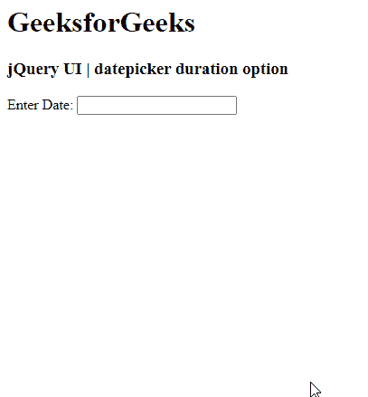

# jquery ui date picker duration option

> 原文:[https://www . geesforgeks . org/jquery-ui-date picker-duration-option/](https://www.geeksforgeeks.org/jquery-ui-datepicker-duration-option/)

**jQuery UI** 由 GUI 小部件、视觉效果和使用 jQuery、CSS 和 HTML 实现的主题组成。jQuery 用户界面非常适合为网页构建用户界面。jquery yui 中的 jQueryUI Datepickers 小部件允许用户轻松直观地输入日期。在本文中，我们将看到如何在 jQuery UI **日期选择器**中使用**持续时间选项**。持续时间选项用于设置 jQuery UI 日期选择器的打开持续时间。

**语法:**

```
$(".selector").datepicker(
   {duration :"slow"}
);
```

**CDN 链接:**首先，添加项目所需的 jQuery UI 脚本。

> <link href="“https://code.jquery.com/ui/1.10.4/themes/ui-lightness/jquery-ui.css”" rel="“stylesheet”">
> <脚本 src = " https://code . jquery . com/jquery-1 . 10 . 2 . js "></脚本>
> <脚本 src = " https://code . jquery . com/ui/1 . 10 . 4/jquery-ui . js "></脚本>

**例 1:**

## 超文本标记语言

```
<!DOCTYPE html>
<html lang="en">
  <head>
    <meta charset="utf-8" />
    <link
      href=
"https://code.jquery.com/ui/1.10.4/themes/ui-lightness/jquery-ui.css"
      rel="stylesheet"/>
    <script src=
"https://code.jquery.com/jquery-1.10.2.js">
    </script>
    <script src=
"https://code.jquery.com/ui/1.10.4/jquery-ui.js">
    </script>
    <script>
      $(function () {
        $("#gfg").datepicker({ dateFormat: "yy/DD/dd/mm", duration: "slow" });
      });
    </script>
  </head>
  <h1>GeeksforGeeks</h1>
  <h3>jQuery UI | datepicker duration option</h3>

  <body>
    <p>Enter Date: <input type="text" id="gfg" /></p>
  </body>
</html>
```

**输出:**



**参考:**T2】https://api.jqueryui.com/datepicker/#option-duration