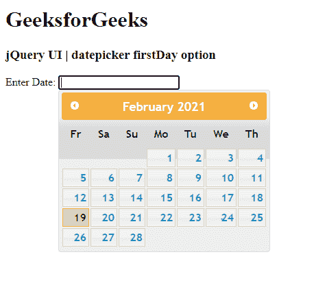

# jquery ui date picker first day option

> 哎哎哎:# t0]https://www . geeksforgeeks . org/jquery-ui-date picker-first day 选项/

jQuery UI 由 GUI 小部件、视觉效果和使用 jQuery、CSS 和 HTML 实现的主题组成。jQuery 用户界面非常适合为网页构建用户界面。 jQueryUI 中的 jQueryUI Datepickers 小部件允许用户轻松直观地输入日期。在本文中我们将看到如何在 jQuery UI Datepicker 中使用 **firstDay 选项** 。 **第一天选项** 指定哪一天被视为 jQuery UI 日期选择器中的第一天。

**语法:**

```html
$(".selector").datepicker(
   {firstDay :1}
);
```

**方法:**首先，添加项目所需的 jQuery UI 脚本。

> <link href="“https://code.jquery.com/ui/1.10.4/themes/ui-lightness/jquery-ui.css”" rel="“stylesheet”">
> <脚本 src = " https://code . jquery . com/jquery-1 . 10 . 2 . js "></脚本>
> <脚本 src = " https://code . jquery . com/ui/1 . 10 . 4/jquery-ui . js "></脚本>

**例 1:**

## 超文本标记语言

```html
<!doctype html>
<html lang="en">

<head>
    <meta charset="utf-8">
    <link href=
"https://code.jquery.com/ui/1.10.4/themes/ui-lightness/jquery-ui.css"
        rel="stylesheet">

    <script src=
        "https://code.jquery.com/jquery-1.10.2.js">
    </script>

    <script src=
        "https://code.jquery.com/ui/1.10.4/jquery-ui.js">
    </script>

    <!-- JavaScript code -->
    <script>
        $(function () {
            $("#gfg").datepicker(
                { firstDay: 5 }
            );
        });
    </script>
</head>

<body>
    <h1>GeeksforGeeks</h1>
    <h3>jQuery UI | datepicker firstDay option</h3>

    <p>Enter Date: <input type="text" id="gfg"></p>
</body>

</html>
```

**输出:**



**参考:**T2】https://api.jqueryui.com/category/widgets/