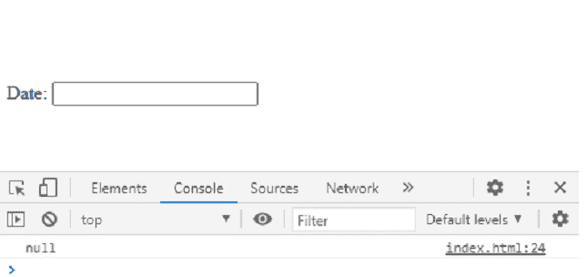
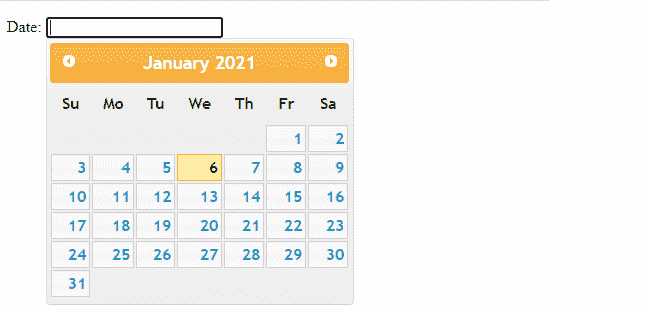
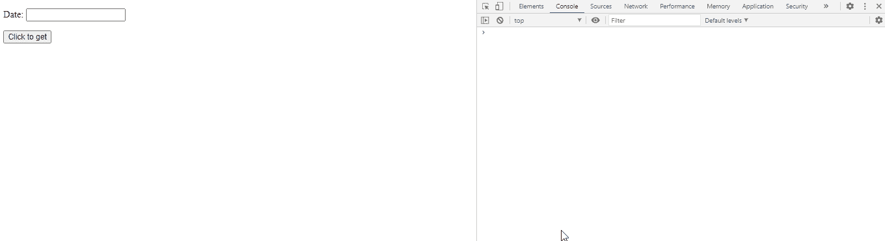

# jQuery UI 日期选择器 getDate()方法

> 原文:[https://www . geesforgeks . org/jquery-ui-date picker-get date-method/](https://www.geeksforgeeks.org/jquery-ui-datepicker-getdate-method/)

jQuery UI date picker**getDate()**方法用于从日期字段获取日期。

**语法:**

```html
var a = $( ".selector" ).datepicker( "getDate" )
```

**参数:**此方法不接受任何参数。

**返回值:**此方法返回日期。

**方法:**首先，添加项目所需的 jQuery 移动脚本。

> <src 脚本= " https://Ajax . Google APIs . com/Ajax/libs/jquery ui/1 . 8 . 16/jquery-ui . js "></script><link href = " http://Ajax . Google APIs . com/Ajax

**例 1:**

## 超文本标记语言

```html
<!doctype html>
<html lang = "en">
   <head>
    <meta charset="utf-8"> 
    <meta name="viewport" content= 
        "width=device-width, initial-scale=1"> 

    <script src= 
"https://ajax.googleapis.com/ajax/libs/jquery/1.7.1/jquery.js"> 
    </script> 

    <script src= 
"https://ajax.googleapis.com/ajax/libs/jqueryui/1.8.16/jquery-ui.js"> 
    </script> 

    <link href= 
"http://ajax.googleapis.com/ajax/libs/jqueryui/1.8.16/themes/ui-lightness/jquery-ui.css"
        rel="stylesheet" type="text/css" /> 

      <script>
         $(function() {
            $( "#datepicker" ).datepicker();
            var a = $( "#datepicker" ).datepicker("getDate");
            console.log(a)
         });
      </script>
   </head>

   <body>
      <p>Date: <input type = "text" 
         id = "datepicker"></p>
   </body>
</html>
```

**输出:**

**无日期选择:**



**带日期选择器选择:**



**例 2:**

## 超文本标记语言

```html
<!doctype html>
<html lang = "en">
   <head>
    <meta charset="utf-8"> 
    <meta name="viewport" content= 
        "width=device-width, initial-scale=1"> 

    <script src= 
"https://ajax.googleapis.com/ajax/libs/jquery/1.7.1/jquery.js"> 
    </script> 

    <script src= 
"https://ajax.googleapis.com/ajax/libs/jqueryui/1.8.16/jquery-ui.js"> 
    </script> 

    <link href= 
"http://ajax.googleapis.com/ajax/libs/jqueryui/1.8.16/themes/ui-lightness/jquery-ui.css"
        rel="stylesheet" type="text/css" /> 

      <script>
         $(function() {
            $( "#datepicker" ).datepicker();

         });
         function me(){
            var a = $( "#datepicker" ).datepicker("getDate");
            console.log(a)
         }
      </script>
   </head>

   <body>
      <p>Date: <input type = "text" 
         id = "datepicker"></p>

      <button onclick="me()">
         Click to get
      </button>
   </body>
</html>
```

**输出:**

 