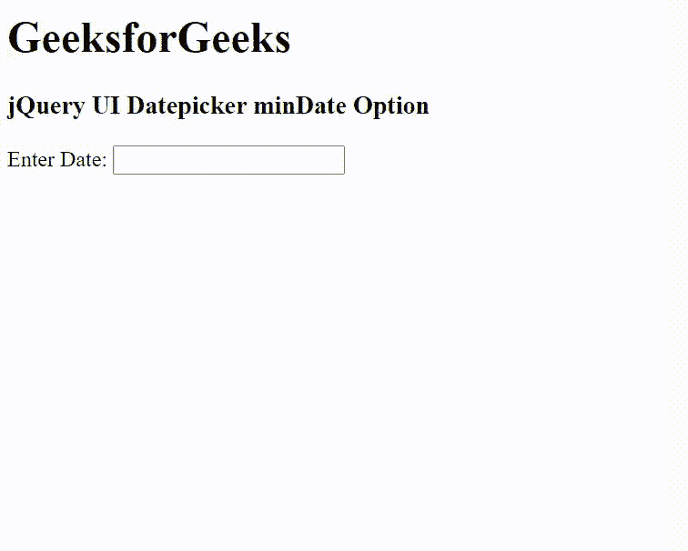

# jquery ui date picker mindate option

> 原文:[https://www . geesforgeks . org/jquery-ui-date picker-mind ate-option/](https://www.geeksforgeeks.org/jquery-ui-datepicker-mindate-option/)

jQuery UI 由 GUI 小部件、视觉效果和使用 jQuery、CSS 和 HTML 实现的主题组成。jQuery 用户界面非常适合为网页构建用户界面。jQuery UI 日期选择器*提醒*选项用于设置最小可选日期。如果我们将其设置为空，则没有最小日期。

**语法:**

```
$( ".selector" ).datepicker({
  minDate: new Date(2007, 1 - 1, 1)
});
```

**CDN 链接:**首先，添加项目所需的 jQuery UI 脚本。

> <link rel="”stylesheet”" href="”//code.jquery.com/ui/1.12.1/themes/smoothness/jquery-ui.css”">
> <脚本 src =//code . jquery . com/jquery-1 . 12 . 4 . js "></脚本>
> <脚本 src =//code . jquery . com/ui/1 . 12 . 1/jquery-ui . js "></脚本>

**示例:**

## 超文本标记语言

```
<!DOCTYPE html>
<html lang="en">

<head>
    <meta charset="utf-8" />
    <link href=
    "https://code.jquery.com/ui/1.10.4/themes/ui-lightness/jquery-ui.css"
        rel="stylesheet" />
    <script src="https://code.jquery.com/jquery-1.10.2.js">
    </script>
    <script src="https://code.jquery.com/ui/1.10.4/jquery-ui.js">
    </script>

    <!-- Javascript -->
    <script>
        $(function () {
            $("#gfg").datepicker({
                minDate: new Date(2021, 1 - 1, 1)
            });
        });
    </script>
</head>

<body>
    <h1>GeeksforGeeks</h1>
    <h3>jQuery UI Datepicker minDate Option</h3>

    <div>Enter Date: <input type="text" id="gfg" /></div>
</body>

</html>
```

**输出:**



minDate 选项

**参考:**[https://API . jquery ui . com/date picker/# option-mindate](https://api.jqueryui.com/datepicker/#option-minDate)