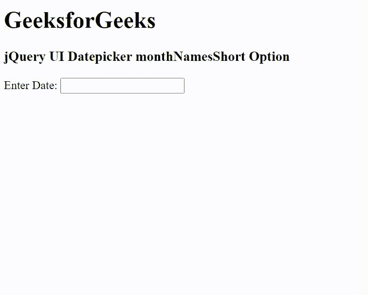

# jquery ui date picker monthnalshort 选项

> 哎哎哎:# t0]https://www . geeksforgeeks . org/jquery-ui-date picker-monthnetamesshort 选项/

jQuery UI 由 GUI 小部件、视觉效果和使用 jQuery、CSS 和 HTML 实现的主题组成。jQuery 用户界面非常适合为网页构建用户界面。jQuery UI date picker*monthnameshort*选项用于设置缩写月份名称列表。它用在每个日期选择器的月标题中。其默认值为[“一月”、“二月”、“三月”、“四月”、“五月”、“六月”、“七月”、“八月”、“九月”、“十月”、“十一月”、“十二月]]。

**语法:**

```
$( ".selector" ).datepicker({
  monthNamesShort: [ "Jan", "Feb", ... , "Nov", "Dec" ]
});
```

**CDN 链接:**首先，添加项目所需的 jQuery UI 脚本。

> <link rel="”stylesheet”" href="”//code.jquery.com/ui/1.12.1/themes/smoothness/jquery-ui.css”">
> <脚本 src =//code . jquery . com/jquery-1 . 12 . 4 . js "></脚本>
> <脚本 src =//code . jquery . com/ui/1 . 12 . 1/jquery-ui . js "></脚本>

**示例:**

## 超文本标记语言

```
<!DOCTYPE html>
<html lang="en">

<head>
    <meta charset="utf-8" />
    <link href=
    "https://code.jquery.com/ui/1.10.4/themes/ui-lightness/jquery-ui.css"
        rel="stylesheet" />
    <script src="https://code.jquery.com/jquery-1.10.2.js">
    </script>
    <script src="https://code.jquery.com/ui/1.10.4/jquery-ui.js">
    </script>

    <!-- Javascript -->
    <script>
        $(function () {
            $("#gfg").datepicker({
                dateFormat: "M",
                monthNamesShort: ["Jan", "Feb", "Mar", "Apr", "Maj",
                    "Jun", "Jul", "Aug", "Sep", "Oct", "Nov", "Dec"]
            });
        });
    </script>
</head>

<body>
    <h1>GeeksforGeeks</h1>
    <h3>jQuery UI Datepicker monthNamesShort Option</h3>

    <div>Enter Date: <input type="text" id="gfg" /></div>
</body>

</html>
```

**输出:**



monthNamesShort 选项

**参考资料:**[https://API . jquery ui . com/date picker/# option-monthnalsh](https://api.jqueryui.com/datepicker/#option-monthNamesShort)