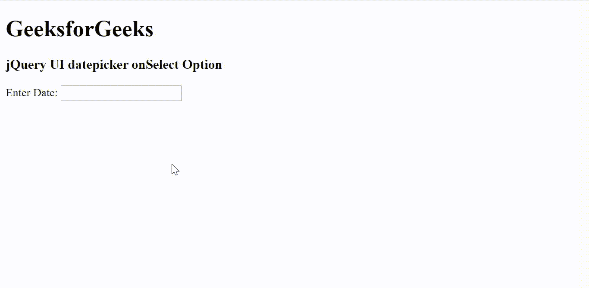

# jQuery UI datepicker 选项

> 哎哎哎:# t0]https://www . geeksforgeeks . org/jquery-ui-date picker-on select 选项/

jQuery UI 由 GUI 小部件、视觉效果和使用 jQuery、CSS 和 HTML 实现的主题组成。jQuery 用户界面非常适合为网页构建用户界面。当选择日期选择器选项时，将调用 jQuery 用户界面日期选择器选择选项。onSelect 选项保存一个函数，该函数包含作为文本的选定日期和作为参数的日期选择器实例。

**语法:**

```html
onSelect: Function( String dateText, Object inst ) {  }
```

**CDN 链接:**首先，添加项目所需的 jQuery UI 脚本。

> <link rel="”stylesheet”" href="”//code.jquery.com/ui/1.12.1/themes/smoothness/jquery-ui.css”">
> <脚本 src =//code . jquery . com/jquery-1 . 12 . 4 . js "></脚本>
> <脚本 src =//code . jquery . com/ui/1 . 12 . 1/jquery-ui . js "></脚本>

**示例:**

## 超文本标记语言

```html
<!DOCTYPE html>
<html lang="en">

<head>
    <meta charset="utf-8" />
    <link href=
    "https://code.jquery.com/ui/1.10.4/themes/ui-lightness/jquery-ui.css" 
        rel="stylesheet" />
    <script src="https://code.jquery.com/jquery-1.10.2.js">
    </script>
    <script src="https://code.jquery.com/ui/1.10.4/jquery-ui.js">
    </script>

    <script>
        $(function () {
            $("#gfg").datepicker({
                onSelect: function (date, datepicker) {
                    if (date != "") {
                        alert("Selected Date: " + date);
                    }
                }
            });
        });
    </script>
</head>

<body>
    <h1>GeeksforGeeks</h1>
    <h3>jQuery UI datepicker onSelect Option</h3>

    <div>Enter Date: <input type="text" id="gfg" /></div>
</body>

</html>
```

**输出:**



**参考:**[https://API . jquery ui . com/date picker/# option-on select](https://api.jqueryui.com/datepicker/#option-onSelect)