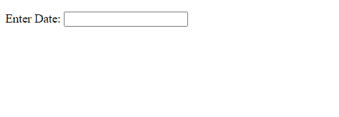

# jQuery UI 日期选择器选项()方法

> 原文:[https://www . geesforgeks . org/jquery-ui-date picker-option-method/](https://www.geeksforgeeks.org/jquery-ui-datepicker-option-method/)

jQuery UI 日期选择器选项(optionName，value)方法用于设置与指定的 optionName 关联的按钮选项的值。

**语法:**

```
$( ".selector" ).datepicker( "option", "disabled", true )
```

**参数:**

*   **选项名称:**要检查的选项。
*   **值:**待检值

**返回值:**该方法返回一个对象值。

**方法:**首先，添加项目所需的 jQuery UI 脚本。

> <link href="“https://code.jquery.com/ui/1.10.4/themes/ui-lightness/jquery-ui.css”" rel="“stylesheet”">
> <脚本 src = " https://code . jquery . com/jquery-1 . 10 . 2 . js "></脚本>
> <脚本 src = " https://code . jquery . com/ui/1 . 10 . 4/jquery-ui . js "></脚本>

**例 1:**

## 超文本标记语言

```
<!DOCTYPE html>
<html lang="en">
    <head>
        <meta charset="utf-8" />
        <link href=
"https://code.jquery.com/ui/1.10.4/themes/ui-lightness/jquery-ui.css" 
              rel="stylesheet" />
        <script src="https://code.jquery.com/jquery-1.10.2.js">
      </script>
        <script src="https://code.jquery.com/ui/1.10.4/jquery-ui.js">
      </script>

        <script>
            $(function () {
                $("#gfg").datepicker();
                $("#gfg").datepicker("option", "enable", true);
            });
        </script>
    </head>

    <body>
        <p>Enter Date: <input type="text" id="gfg" /></p>
    </body>
</html>
```

**输出:**



**例 2:**

## 超文本标记语言

```
<!DOCTYPE html>
<html lang="en">
    <head>
        <meta charset="utf-8" />
        <link href=
"https://code.jquery.com/ui/1.10.4/themes/ui-lightness/jquery-ui.css" 
              rel="stylesheet" />
        <script src="https://code.jquery.com/jquery-1.10.2.js">
      </script>
        <script src="https://code.jquery.com/ui/1.10.4/jquery-ui.js">
      </script>

        <script>
            $(function () {
                $("#gfg").datepicker();
                $("#gfg").datepicker("option", "disabled", true);
            });
        </script>
    </head>

    <body>
        <p>Enter Date: <input type="text" id="gfg" /></p>
    </body>
</html>
```

**输出:**

