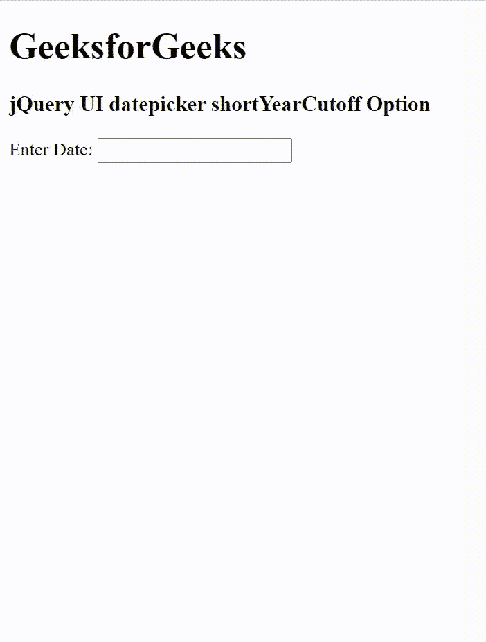

# jquery ui date picker short run option

> 哎哎哎:# t0]https://www . geeksforgeeks . org/jquery-ui-date picker-shortyear cutoff 选项/

jQuery UI 由 GUI 小部件、视觉效果和使用 jQuery、CSS 和 HTML 实现的主题组成。jQuery 用户界面非常适合为网页构建用户界面。jQuery UI 日期选择器*短年截止*选项用于设置日期的世纪。小于或等于截止年的输入年份值被视为当前世纪。比那个大的年份被认为是在上个世纪。

它支持两种类型的值。

*   **数字:**包含 0 到 99 范围内的值，表示截止年份。
*   **字符串:**包含从当年开始的相对年数。

**语法:**

```html
$( ".selector" ).datepicker({
  shortYearCutoff: num
});
```

**CDN 链接:**首先，添加项目所需的 jQuery UI 脚本。

> <link rel="”stylesheet”" href="”//code.jquery.com/ui/1.12.1/themes/smoothness/jquery-ui.css”">
> <脚本 src =//code . jquery . com/jquery-1 . 12 . 4 . js "></脚本>
> <脚本 src =//code . jquery . com/ui/1 . 12 . 1/jquery-ui . js "></脚本>

**示例:**

## 超文本标记语言

```html
<!DOCTYPE html>
<html lang="en">

<head>
    <meta charset="utf-8" />
    <link href=
    "https://code.jquery.com/ui/1.10.4/themes/ui-lightness/jquery-ui.css"
        rel="stylesheet" />
    <script src="https://code.jquery.com/jquery-1.10.2.js">
    </script>
    <script src="https://code.jquery.com/ui/1.10.4/jquery-ui.js">
    </script>

    <script>
        $(function () {
            $("#gfg").datepicker({
                changeMonth: true,
                changeYear: true,
                dateFormat: 'm/d/y',
                shortYearCutoff: '30',
                yearRange: '2010:2030'
            });
        });
    </script>
</head>

<body>
    <h1>GeeksforGeeks</h1>
    <h3>jQuery UI datepicker shortYearCutoff Option</h3>

    <div>Enter Date: <input type="text" id="gfg" /></div>
</body>

</html>
```

**输出:**



短期截止期权

**参考:**[https://API . jquery ui . com/date picker/# option-shortyear execution](https://api.jqueryui.com/datepicker/#option-shortYearCutoff)