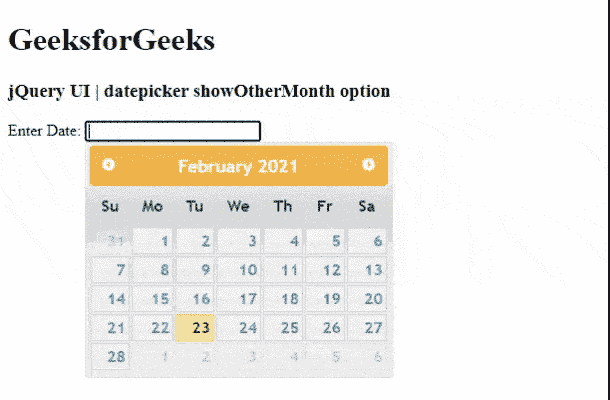

# jQuery UI 日期选择器显示其他月份选项

> 原文:[https://www . geesforgeks . org/jquery-ui-date picker-showothermonths-option/](https://www.geeksforgeeks.org/jquery-ui-datepicker-showothermonths-option/)

jQuery UI 由 GUI 小部件、视觉效果和使用 jQuery、CSS 和 HTML 实现的主题组成。jQuery 用户界面非常适合为网页构建用户界面。jQuery UI Datepicker 允许用户轻松直观地输入日期。在本文中，我们将看到如何在日期选择器中使用 **showOtherMonths** 选项。**显示其他月份**选项如果设置为真，其他月份将显示在 jQuery 用户界面日期选择器中。

**语法:**

```html
$(".selector").datepicker(
   {showOtherMonths : true}
);
```

**进场:**

*   首先，添加项目所需的 jQuery UI 脚本。

> <link href="“https://code.jquery.com/ui/1.10.4/themes/ui-lightness/jquery-ui.css”" rel="“stylesheet”">

**示例:**

## 超文本标记语言

**输出:**



显示其他月份选项

参考:https://API . jquery ui . com/date picker/