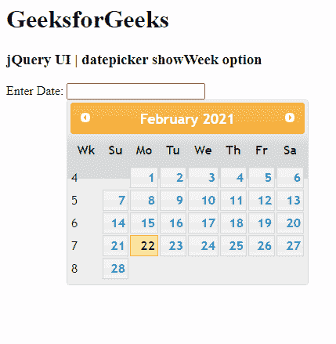

# jquery ui date picker show week option

> 原文:[https://www . geesforgeks . org/jquery-ui-date picker-show week-option/](https://www.geeksforgeeks.org/jquery-ui-datepicker-showweek-option/)

jQuery UI 由 GUI 小部件、视觉效果和使用 jQuery、CSS 和 HTML 实现的主题组成。jQuery 用户界面非常适合为网页构建用户界面。jQuery UI Datepickers 小部件允许用户轻松直观地输入日期。在本文中，我们将看到如何在 jQuery UI Datepicker 中使用 **showWeek** 选项。**显示周**选项如果设置为*真，*周将显示在日期选择器中。

**语法:**

```
$(".selector").datepicker(
   {showWeeks: true}
);
```

**CDN 链接:**首先，添加项目所需的 jQuery UI 脚本。

> <link href="“https://code.jquery.com/ui/1.10.4/themes/ui-lightness/jquery-ui.css”" rel="“stylesheet”">
> <脚本 src = " https://code . jquery . com/jquery-1 . 10 . 2 . js "></脚本>
> <脚本 src = " https://code . jquery . com/ui/1 . 10 . 4/jquery-ui . js "></脚本>

**示例:**

## 超文本标记语言

```
<!DOCTYPE html>
<html lang="en">
  <head>
    <meta charset="utf-8" />
    <link href=
"https://code.jquery.com/ui/1.10.4/themes/ui-lightness/jquery-ui.css"
      rel="stylesheet"/>
    <script src=
"https://code.jquery.com/jquery-1.10.2.js">
    </script>
    <script src=
"https://code.jquery.com/ui/1.10.4/jquery-ui.js">
    </script>

    <!-- Javascript -->
    <script>
      $(function () {
        $("#gfg").datepicker({ showWeek: true });
      });
    </script>
  </head>
  <h1>GeeksforGeeks</h1>
  <h3>jQuery UI | datepicker showWeek option</h3>

  <body>
    <!-- HTML -->

    <p>Enter Date: <input type="text" id="gfg" /></p>
  </body>
</html>
```

**输出:**



**参考:**T2】https://api.jqueryui.com/datepicker/#option-showWeek