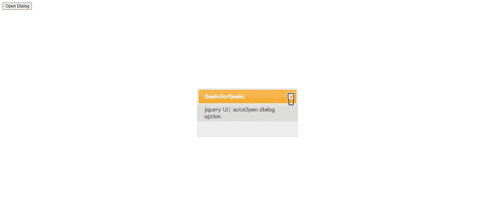
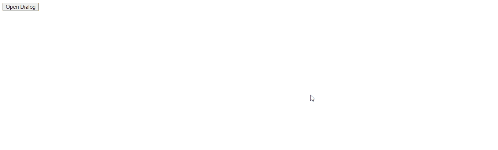

# jQuery 用户界面对话框自动打开选项

> 原文:[https://www . geesforgeks . org/jquery-ui-dialog-auto open-option/](https://www.geeksforgeeks.org/jquery-ui-dialog-autoopen-option/)

“自动打开”选项指示在最初加载页面时对话框是否应该自动打开。默认情况下，值为**真**。

**语法:**

```html
$( ".selector" ).dialog({
  autoOpen: false
});
```

**方法:**首先，添加项目所需的 jQuery UI 脚本。

> <link href="“https://code.jquery.com/ui/1.10.4/themes/ui-lightness/jquery-ui.css”" rel="“stylesheet”">
> <脚本 src = " https://code . jquery . com/jquery-1 . 10 . 2 . js "></脚本>
> <脚本 src = " https://code . jquery . com/ui/1 . 10 . 4/jquery-ui . js "></脚本>

**例 1:**

## 超文本标记语言

```html
<!doctype html>
<html lang="en">

<head>
    <meta charset="utf-8">
    <link href=
"https://code.jquery.com/ui/1.10.4/themes/ui-lightness/jquery-ui.css"
        rel="stylesheet">
    <script src="https://code.jquery.com/jquery-1.10.2.js"></script>
    <script src="https://code.jquery.com/ui/1.10.4/jquery-ui.js">
    </script>

    <script>
        $(function () {
            $("#gfg").dialog({
                autoOpen: true,
            });
            $("#geeks").click(function () {
                $("#gfg").dialog("open");
            });
        });
    </script>
</head>

<body>
    <div id="gfg" title="GeeksforGeeks">
        jquery UI| autoOpen dialog option
    </div>

    <button id="geeks">Open Dialog</button>
</body>

</html>
```

**输出:**



**例 2:**

## 超文本标记语言

```html
<!doctype html>
<html lang="en">

<head>
    <meta charset="utf-8">
    <link href=
"https://code.jquery.com/ui/1.10.4/themes/ui-lightness/jquery-ui.css"
        rel="stylesheet">
    <script src="https://code.jquery.com/jquery-1.10.2.js"></script>
    <script src="https://code.jquery.com/ui/1.10.4/jquery-ui.js">
    </script>

    <script>
        $(function () {
            $("#gfg").dialog({
                autoOpen: false,
            });
            $("#geeks").click(function () {
                $("#gfg").dialog("open");
            });
        });
    </script>
</head>

<body>
    <div id="gfg" title="GeeksforGeeks">
        Jquery UI| autoOpen dialog option
    </div>

    <button id="geeks">Open Dialog</button>
</body>

</html>
```

**输出:**

