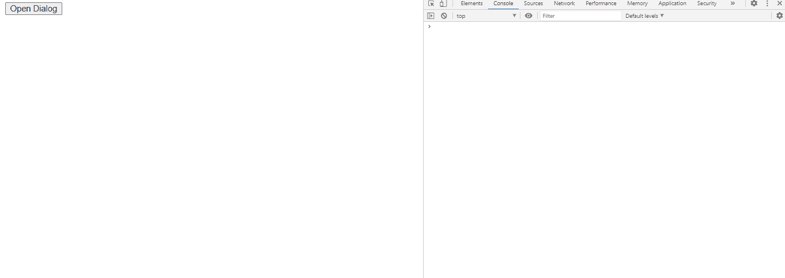

# jQuery UI 对话框拖动事件

> 原文:[https://www.geeksforgeeks.org/jquery-ui-dialog-drag-event/](https://www.geeksforgeeks.org/jquery-ui-dialog-drag-event/)

拖动对话框时触发 jQuery UI 拖动事件。

在这里了解更多关于 jQuery 选择器和事件[的信息。](https://www.geeksforgeeks.org/jquery-selectors-and-event-methods/)

**语法:**

```html
$(".selector").dialog (
   drag: function( event, ui ) {
       console.log('dragged')
   },
```

**进场:**

*   首先，添加项目所需的 jQuery Mobile 脚本。

```html
<link href = 
"https://code.jquery.com/ui/1.10.4/themes/ui-lightness/jquery-ui.css"
    rel = "stylesheet">
<script src = "https://code.jquery.com/jquery-1.10.2.js">
    </script>
<script src = "https://code.jquery.com/ui/1.10.4/jquery-ui.js">
    </script>
```

*   “打开对话框”按钮将触发点击功能(#gfg)，该功能将进一步打开对话框(#gfg2)中的<textarea>。</textarea>
*   拖动(事件，用户界面) :鼠标移动时触发。这个拖动有一个回调函数，每当鼠标移动时就会被触发。
    *   事件:类型->事件
    *   用户界面:类型->对象
    *   回调函数:函数(事件，用户界面){ console.log('拖动')}

**例 1:**

## 超文本标记语言

```html
<!doctype html>
<html lang = "en">
   <head>
      <meta charset = "utf-8">
      <link href = 
"https://code.jquery.com/ui/1.10.4/themes/ui-lightness/jquery-ui.css"
         rel = "stylesheet">
      <script src = "https://code.jquery.com/jquery-1.10.2.js">
         </script>
      <script src = "https://code.jquery.com/ui/1.10.4/jquery-ui.js">
         </script>

      <script type = "text/javascript">
         $(function() {
            $( "#gfg2" ).dialog({
          autoOpen: false, 
               drag: function( event, ui ) {
                  console.log('dragged')
               },
            });
            $( "#gfg" ).click(function() {
               $( "#gfg2" ).dialog( "open" );
            });
         });
      </script>
   </head>

   <body>
      <div id = "gfg2" title="GeeksforGeeks">
         <textarea>jQuery UI | drag(event, ui) Event</textarea>
      </div>
      <button id = "gfg">Open Dialog</button>
   </body>
</html>
```

**输出:**

