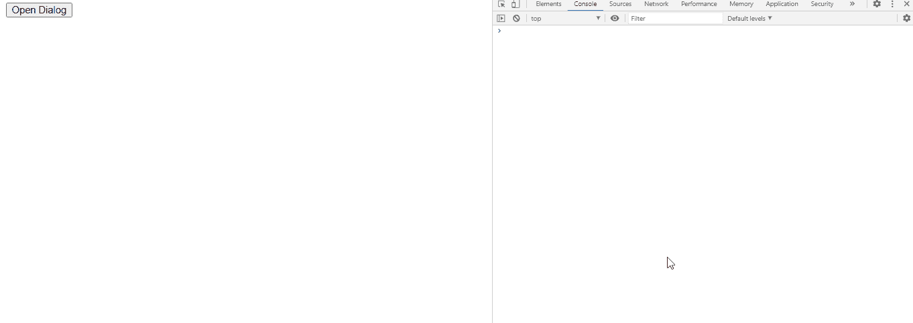

# jQuery 用户界面对话框拖动停止事件

> 原文:[https://www . geesforgeks . org/jquery-ui-dialog-drag stop-event/](https://www.geeksforgeeks.org/jquery-ui-dialog-dragstop-event/)

jQuery UI dragStop 事件是我们拖动后对话框停止时触发的。

**语法:**

```html
$(".selector").dialog (
   dragStop: function( event, ui ) {
       console.log('dragged')
   },
```

**方法:**首先，添加项目所需的 jQuery UI 脚本。

> <link href="“https://code.jquery.com/ui/1.10.4/themes/ui-lightness/jquery-ui.css”" rel="“stylesheet”">
> <脚本 src = " https://code . jquery . com/jquery-1 . 10 . 2 . js "></脚本>
> <脚本 src = " https://code . jquery . com/ui/1 . 10 . 4/jquery-ui . js "></脚本>

**示例:**

## 超文本标记语言

```html
<!doctype html>
<html lang="en">

<head>
    <meta charset="utf-8">
    <link href=
"https://code.jquery.com/ui/1.10.4/themes/ui-lightness/jquery-ui.css"
        rel="stylesheet">
    <script src="https://code.jquery.com/jquery-1.10.2.js"></script>

    <script src="https://code.jquery.com/ui/1.10.4/jquery-ui.js">
    </script>

    <script type="text/javascript">
        $(function () {
            $("#gfg2").dialog({
                autoOpen: false,
                dragStop: function (event, ui) {
                    console.log('dragged')
                },
            });
            $("#gfg").click(function () {
                $("#gfg2").dialog("open");
            });
        });
    </script>
</head>

<body>
    <div id="gfg2" title="GeeksforGeeks">
        <textarea>
            jQuery UI | dragStop(event, ui) Event
        </textarea>
    </div>

    <button id="gfg">Open Dialog</button>
</body>

</html>
```

**输出:**

