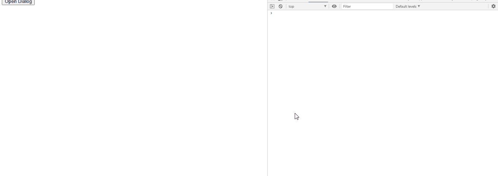

# jQuery 用户界面对话框焦点事件

> 原文:[https://www . geesforgeks . org/jquery-ui-dialog-focuseventui-event/](https://www.geeksforgeeks.org/jquery-ui-dialog-focuseventui-event/)

对话框是通知用户某事的方式。这是一个很好的方法，可以在用户窗口上弹出，显示下一个将要发生的信息，或者开发人员想要向用户阐明的任何类型的信息。jQueryUI 对话框方法用于在页面内部创建一个基本的对话框窗口。它有一个标题栏和一个内容区，默认情况下可以用“X”图标移动、调整大小和关闭。当对话框获得焦点时，焦点事件被触发。

**语法:**

```html
$(".selector").dialog (
   focused: function( event, ui ) {
       console.log('focused')
   }, 
```

**CDN 链接:**首先，添加项目所需的 jQuery Mobile 脚本。

> <link href="“https://code.jquery.com/ui/1.10.4/themes/ui-lightness/jquery-ui.css”&nbsp;" rel="”stylesheet”">
> <脚本 src = " https://code . jquery . com/jquery-1 . 10 . 2 . js "></脚本>
> <脚本 src = " https://code . jquery . com/ui/1 . 10 . 4/jquery-ui . js "></脚本>

**例 1:**

*   “打开对话框”按钮将触发点击功能(#gfg)，该功能将进一步打开对话框(#gfg2)中的“文本区域”。
*   focus( event, ui ) : Triggers box gains focus. There is callback function attached to this focus.
    event : Type -> Event

    用户界面:类型->对象

    回调函数:函数(事件，ui ) { console.log('focused')}

## 超文本标记语言

```html
<!DOCTYPE html>
<html lang="en">
  <head>
    <meta charset="utf-8" />
    <link href=
"https://code.jquery.com/ui/1.10.4/themes/ui-lightness/jquery-ui.css"
      rel="stylesheet"/>
    <script src=
"https://code.jquery.com/jquery-1.10.2.js">
    </script>
    <script src=
"https://code.jquery.com/ui/1.10.4/jquery-ui.js">
    </script>
    <script type="text/javascript">
      $(function () {
        $("#gfg2").dialog({
          autoOpen: false,
          focus: function (event, ui) {
            console.log("focused");
          },
        });
        $("#gfg").click(function () {
          $("#gfg2").dialog("open");
        });
      });
    </script>
  </head>
  <body>
    <div id="gfg2" title="GeeksforGeeks">
      <textarea>jQuery UI | focus(event, ui) Event</textarea>
    </div>
    <button id="gfg">Open Dialog</button>
  </body>
</html>
```

**输出:**



**参考:**T2】https://api.jqueryui.com/1.9/dialog/#event-focus