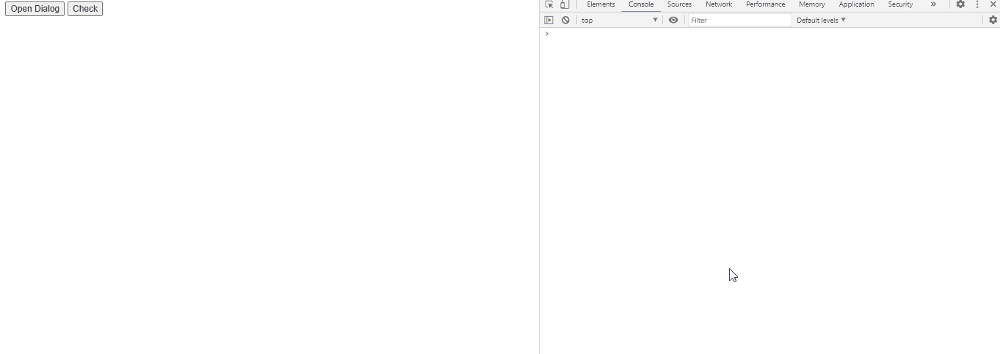

# jQuery UI 对话框 isOpen()方法

> 原文:[https://www . geeksforgeeks . org/jquery-ui-dialog-isopen-method/](https://www.geeksforgeeks.org/jquery-ui-dialog-isopen-method/)

**isOpen(** )方法用于检查对话框是否打开。此方法不接受任何参数

**语法:**

```html
$( ".selector" ).dialog("isOpen");
```

**方法:**首先，添加项目所需的 jQuery UI 脚本。

> <link href="“https://code.jquery.com/ui/1.10.4/themes/ui-lightness/jquery-ui.css”" rel="“stylesheet”">
> <脚本 src = " https://code . jquery . com/jquery-1 . 10 . 2 . js "></脚本>
> <脚本 src = " https://code . jquery . com/ui/1 . 10 . 4/jquery-ui . js "></脚本>

**示例:**

## 超文本标记语言

```html
<!doctype html>
<html lang="en">

<head>
    <meta charset="utf-8">
    <link href=
"https://code.jquery.com/ui/1.10.4/themes/ui-lightness/jquery-ui.css"
            rel="stylesheet">
    <script src="https://code.jquery.com/jquery-1.10.2.js"></script>
    <script src="https://code.jquery.com/ui/1.10.4/jquery-ui.js">
    </script>

    <script>
        $(function () {
            $("#gfg").dialog({
                autoOpen: false,
            });
            $("#geeks").click(function () {
                $("#gfg").dialog("open");

            });
            $("#geek").click(function () {
                var a = $("#gfg").dialog("isOpen");
                console.log(a)
            });
        });
    </script>
</head>

<body>
    <div id="gfg" title="GeeksforGeeks">
        Jquery UI| isOpen dialog method
    </div>

    <button id="geeks">Open Dialog</button>

    <button id="geek">Check</button>
</body>

</html>
```

**输出:**

