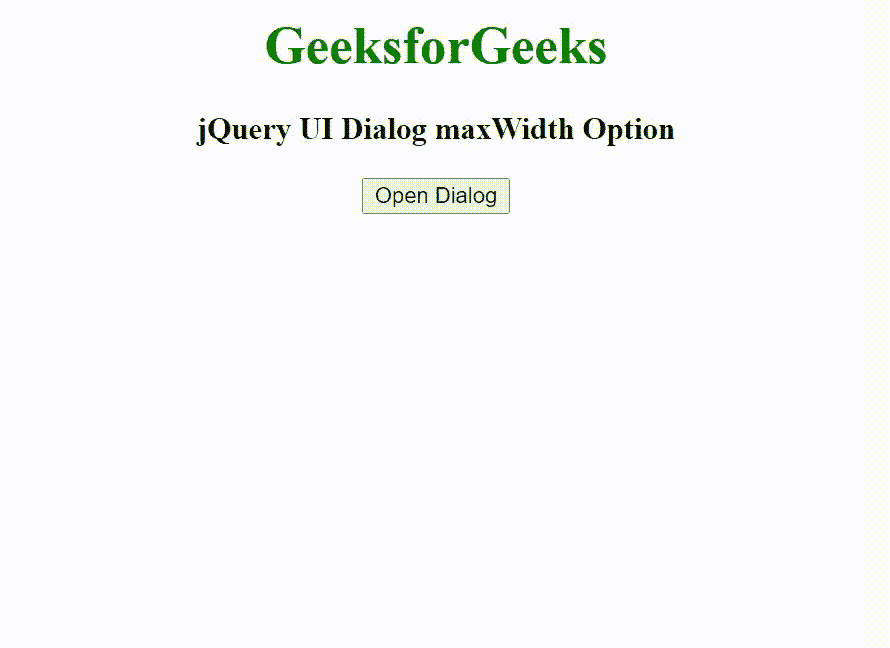

# jQuery 用户界面对话框最大宽度选项

> 原文:[https://www . geesforgeks . org/jquery-ui-dialog-maxwidth-option/](https://www.geeksforgeeks.org/jquery-ui-dialog-maxwidth-option/)

jQuery UI 由 GUI 小部件、视觉效果和使用 HTML、CSS 和 jQuery 实现的主题组成。jQuery 用户界面非常适合为网页构建用户界面。jQuery UI 对话框最大宽度选项用于设置对话框可以调整大小的最大宽度，以像素为单位。

**语法:**

```
$( ".selector" ).dialog({
  maxWidth: 600
});
```

**CDN 链接:**首先，添加项目所需的 jQuery UI 脚本。

> <link rel="”stylesheet”" href="”https://code.jquery.com/ui/1.10.4/themes/ui-lightness/jquery-ui.css”">
> <脚本 src = " https://code . jquery . com/jquery-1 . 10 . 2 . js "></脚本>
> <脚本 src = " https://code . jquery . com/ui/1 . 10 . 4/jquery-ui . js "></脚本>

**示例:**

## 超文本标记语言

```
<!doctype html>
<html lang="en">

<head>
    <meta charset="utf-8">
    <link href=
    "https://code.jquery.com/ui/1.10.4/themes/ui-lightness/jquery-ui.css"
        rel="stylesheet">
    <script src="https://code.jquery.com/jquery-1.10.2.js"></script>
    <script src="https://code.jquery.com/ui/1.10.4/jquery-ui.js"></script>

    <script>
        $(function () {
            $("#gfg").dialog({
                autoOpen: false,
                maxWidth: 400
            });
            $("#geeks").click(function () {
                $("#gfg").dialog("open");
            });
        });
    </script>
</head>

<body style="text-align: center;">
    <h1 style="color:green;">GeeksforGeeks</h1>
    <h3>jQuery UI Dialog maxWidth Option</h3>

    <button id="geeks">Open Dialog</button>

    <div id="gfg" title="GeeksforGeeks">
        Welcome to GeeksforGeeks
    </div>
</body>

</html>
```

**输出:**



**参考:**T2】https://api.jqueryui.com/dialog/#option-maxWidth