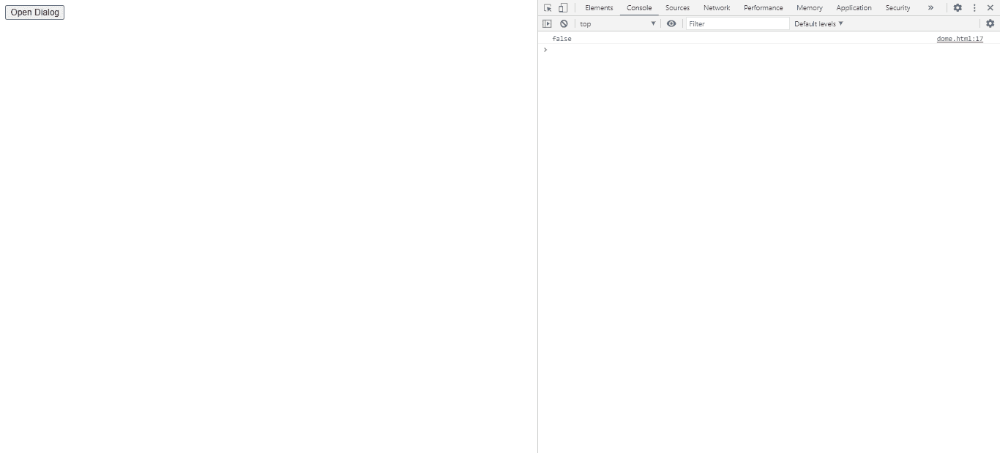

# jQuery UI 对话框选项(optionName)方法

> 原文:[https://www . geesforgeks . org/jquery-ui-dialog-option option name-method/](https://www.geeksforgeeks.org/jquery-ui-dialog-optionoptionname-method/)

此操作获取 当前与指定选项名称 关联的值。选项名称的类型是*字符串*。

**语法:**

```html
var a = $( ".selector" ).dialog("option","disabled");
```

**进场:**

*   首先，添加项目所需的 jQuery Mobile 脚本。

```html
<link href = 
"https://code.jquery.com/ui/1.10.4/themes/ui-lightness/jquery-ui.css"
    rel = "stylesheet">
<script src = "https://code.jquery.com/jquery-1.10.2.js"></script>
<script src = "https://code.jquery.com/ui/1.10.4/jquery-ui.js">
    </script>
```

**例 1:**

## 超文本标记语言

```html
<!doctype html>                                             
<html lang = "en">
   <head>
      <meta charset = "utf-8">
      <link href = 
"https://code.jquery.com/ui/1.10.4/themes/ui-lightness/jquery-ui.css"
         rel = "stylesheet">
      <script src = "https://code.jquery.com/jquery-1.10.2.js">
        </script>
      <script src = "https://code.jquery.com/ui/1.10.4/jquery-ui.js">
        </script>

      <script>
         $(function() {
            $( "#gfg" ).dialog({
               autoOpen: false,
            });
            $( "#geeks" ).click(function() {
            var a = $( "#gfg" ).dialog( "option","disabled");
            console.log(a)
            });
         });
      </script>
   </head>

   <body>

      <div id = "gfg" title="GeeksforGeeks">Jquery UI| option(optionName) dialog method</div>
      <button id = "geeks">Open Dialog</button>
   </body>
</html>
```

**输出:**

