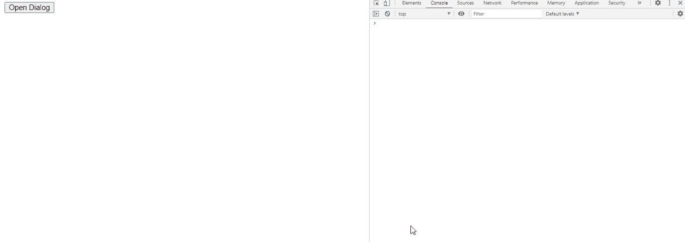

# jQuery 用户界面对话框调整大小事件

> 原文:[https://www . geesforgeks . org/jquery-ui-dialog-resizeeventui-event/](https://www.geeksforgeeks.org/jquery-ui-dialog-resizeeventui-event/)

当对话框调整大小时，jQuery UI 调整大小事件被触发。

在这里了解更多关于 jQuery 选择器和事件[的信息。](https://www.geeksforgeeks.org/jquery-selectors-and-event-methods/)

**语法:**

```
$(".selector").dialog (
   resize: function( event, ui ) {
       console.log('resized')
   },
```

**进场:**

*   首先，添加项目所需的 jQuery Mobile 脚本。

> <link href="“https://code.jquery.com/ui/1.10.4/themes/ui-lightness/jquery-ui.css”<br/"> rel = "样式表">
> <script src = " https://code . jquery . com/jquery-1 . 10 . 2 . js "></script>
> <script src = " https://code . jquery . com/ui/1 . 10 . 4/jquery-ui . js "></script>

**例 1:**

## 超文本标记语言

```
<!doctype html>
<html lang = "en">
   <head>
      <meta charset = "utf-8">
      <link href = 
"https://code.jquery.com/ui/1.10.4/themes/ui-lightness/jquery-ui.css"
         rel = "stylesheet">
      <script src = "https://code.jquery.com/jquery-1.10.2.js">
        </script>
      <script src = "https://code.jquery.com/ui/1.10.4/jquery-ui.js">
         </script>

      <script type = "text/javascript">
         $(function() {
            $( "#gfg2" ).dialog({
          autoOpen: false, 
               resize: function( event, ui ) {
                  console.log('resized')
               },
            });
            $( "#gfg" ).click(function() {
               $( "#gfg2" ).dialog( "open" );
            });
         });
      </script>
   </head>

   <body>
      <div id = "gfg2" title="GeeksforGeeks">
         <textarea>jQuery UI | resize(event, ui) Event</textarea>
      </div>
      <button id = "gfg">Open Dialog</button>
   </body>
</html>
```

**输出:**

