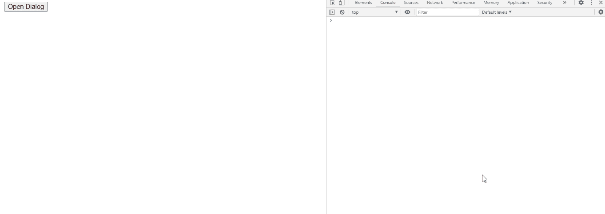

# jQuery 用户界面对话框调整开始事件

> 原文:[https://www . geesforgeks . org/jquery-ui-dialog-resize start-event/](https://www.geeksforgeeks.org/jquery-ui-dialog-resizestart-event/)

当对话框开始调整大小时，jQuery UI resizeStart 事件被触发。

**语法:**

```html
$(".selector").dialog (
    resizeStart: function( event, ui ) {
        console.log('resized')
 },
```

**方法:**首先，添加项目所需的 jQuery UI 脚本。

> <link href="“https://code.jquery.com/ui/1.10.4/themes/ui-lightness/jquery-ui.css”" rel="“stylesheet”">
> <脚本 src = " https://code . jquery . com/jquery-1 . 10 . 2 . js "></脚本>
> <脚本 src = " https://code . jquery . com/ui/1 . 10 . 4/jquery-ui . js "></脚本>

**示例:**

## 超文本标记语言

```html
<!doctype html>
<html lang="en">

<head>
    <meta charset="utf-8">
    <link rel="stylesheet" href=
"https://code.jquery.com/ui/1.10.4/themes/ui-lightness/jquery-ui.css">

    <script src="https://code.jquery.com/jquery-1.10.2.js">
    </script>

    <script src="https://code.jquery.com/ui/1.10.4/jquery-ui.js">
    </script>

    <script type="text/javascript">
        $(function () {
            $("#gfg2").dialog({
                autoOpen: false,
                resizeStart: function (event, ui) {
                    console.log('resized')
                },
            });
            $("#gfg").click(function () {
                $("#gfg2").dialog("open");
            });
        });
    </script>
</head>

<body>
    <div id="gfg2" title="GeeksforGeeks">
        <textarea>
            jQuery UI | resizeStart(event, ui) Event
        </textarea>
    </div>

    <button id="gfg">Open Dialog</button>
</body>

</html>
```

**输出:**

