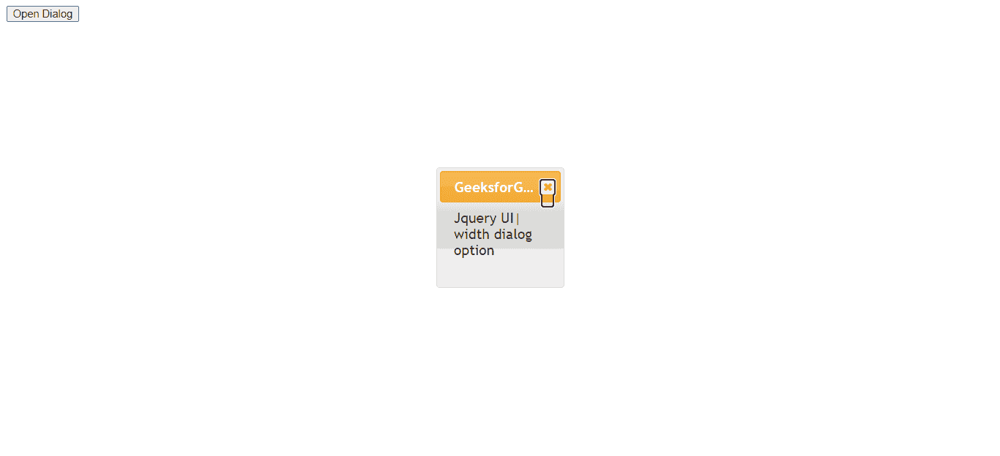
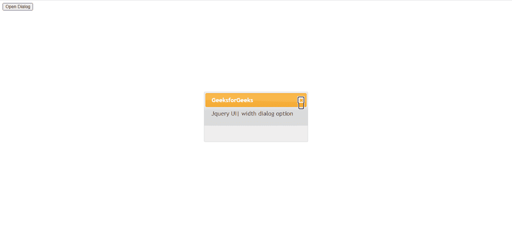

# jQuery 用户界面对话框宽度选项

> 原文:[https://www . geesforgeks . org/jquery-ui-dialog-width-option/](https://www.geeksforgeeks.org/jquery-ui-dialog-width-option/)

**对话框宽度**选项用于设置对话框的宽度，单位为像素。默认情况下，该值为 300。

**语法:**

```html
$( ".selector" ).dialog({
  width : 120
});
```

**方法:**首先，添加项目所需的 jQuery UI 脚本。

> <link href="”https://code.jquery.com/ui/1.10.4/themes/ui-lightness/jquery-ui.css”">
> <脚本 src = " https://code . jquery . com/jquery-1 . 10 . 2 . js "></脚本>
> <脚本 src = " https://code . jquery . com/ui/1 . 10 . 4/jquery-ui . js "></脚本>

**例 1:**

## 超文本标记语言

```html
<!doctype html>
<html>
<head>
  <link href=
"https://code.jquery.com/ui/1.10.4/themes/ui-lightness/jquery-ui.css" 
        rel="stylesheet">
  <script src=
"https://code.jquery.com/jquery-1.10.2.js">
  </script>
  <script src=
"https://code.jquery.com/ui/1.10.4/jquery-ui.js">
  </script>
  <script>
    $(function () {
      $("#gfg").dialog({
        autoOpen: false,
        width: 100
      });
      $("#geeks").click(function () {
        $("#gfg").dialog("open");
      });
    });
  </script>
</head>
<body>
  <div id="gfg">
    Jquery UI| width dialog option
  </div>
  <button id="geeks">Open Dialog</button>
</body>
</html>
```

**输出:**



**例 2:**

## 超文本标记语言

```html
<!DOCTYPE html>
<html>
<head>
  <link href=
"https://code.jquery.com/ui/1.10.4/themes/ui-lightness/jquery-ui.css" 
        rel="stylesheet">
  <script src=
"https://code.jquery.com/jquery-1.10.2.js">
  </script>
  <script src=
"https://code.jquery.com/ui/1.10.4/jquery-ui.js">
  </script>
  <script>
    $(function () {
      $("#gfg").dialog({
        autoOpen: false,
        width: 300
      });
      $("#geeks").click(function () {
        $("#gfg").dialog("open");
      });
    });
  </script>
</head>
<body>
  <div id="gfg">
    Jquery UI| width dialog option
  </div>
  <button id="geeks">Open Dialog</button>
</body>
</html>
```

**输出:**

