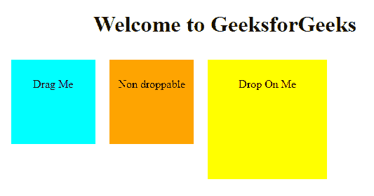

# jQuery UI |可拖动()和可拖放()方法

> 原文:[https://www . geesforgeks . org/jquery-ui-draggable-and-dropped-methods/](https://www.geeksforgeeks.org/jquery-ui-draggable-and-droppable-methods/)

**jQuery UI** 是方法和一组用户界面效果、小部件、交互和主题的混合，可以使用 jQuery 方法在网页中提供。如果你想建立一个强大的网络应用程序，包括各种功能，如拖放，日期选择器，工具提示等。那么 jQuery UI 就是构建这些效果的完美选择。
在本文中，我们将了解各种 jQuery UI 交互。

**Draggable() Method**

这个方法允许在鼠标的帮助下拖动元素。使用 jQuery UI，我们可以将 DOM( **D** 文档 **O** 对象 **M** 模型)元素拖动到视图端口内的任何位置。这可以通过用鼠标点击可拖动对象并将其拖动到视图端口内的任何位置来实现。

**语法:**
draggable()方法有两种形式，每种形式的使用取决于需求。这些措施如下

```
$(selector, context).draggable (options);
```

```
$(selector, context).draggable ("action", [params]);
```

**下表显示了该方法可以使用的不同选项:**

<figure class="table">

| 选择权 | 目的 |
| --- | --- |
| addClass(添加类) | 如果该选项的值设置为 false，它将阻止 DOM 元素被拖动。该选项的默认值为真。 |
| 轴 | 此选项用于约束可拖动对象的移动。如果该选项的值设置为 Y，则只能在垂直方向拖动对象，如果该选项的值设置为 X，则只能在水平方向拖动对象。 |
| 包含 | 此选项也用于约束可拖动对象在特定区域或某个元素内的移动。此选项的默认值为 false。 |
| 不透明 | 此选项用于控制可拖动对象被拖动时的不透明度。此选项的默认值为 false。 |

</figure>

**示例:**
在本例中，id =“D1”的< div >可以拖动到视图端口内的任何位置，id =“D2”的< div >可以沿 X 轴拖动，id =“D3”的< div >可以沿 Y 轴拖动。

**代码#1:**

## 超文本标记语言

```
<!doctype html>
<html>
<head>
<title>jQuery UI Draggable</title>
<link rel="stylesheet" href="//code.jquery.com/ui/
                            1.12.1/themes/base/jquery-ui.css">
<link rel="stylesheet" href="/resources/demos/style.css">
<style type="text/css">
#d1 {
    width: 120px;
    height: 120px;
    background-color :aqua;
    padding:20px;
    float:left;
    margin:5px;
    }
#d2 {
    width: 120px;
    height: 120px;
    background-color :orange;
    padding:20px;
    float:left;
    margin:5px;
    }
#d3 {
    width: 120px;
    height: 120px;
    background-color :yellow;
    padding:20px;
    float:left;
    margin:5px;
    }
</style>
<script src="https://code.jquery.com/jquery-1.12.4.js"></script>
<script src="https://code.jquery.com/ui/1.12.1/jquery-ui.js">
</script>
</head>
<body>
<h1>Welcome to GeeksforGeeks</h1>
<div id="d1">

<p>Drag Me Anywhere</p>

</div>
<div id="d2">

<p>Drag Me Horizontally</p>

</div>
<div id="d3">

<p>Drag Me Vertically</p>

</div>
<script type="text/javascript">
$( function() {
    $("#d1").draggable();
} );
$( function() {
    $("#d2").draggable({axis:"x"});
} );
$( function() {
    $("#d3").draggable({axis :"y"});
} );
</script>
</body>
</html>                                          
```

**输出:**

拖动前


拖动后


**Droppable() Method:**

这个方法允许在鼠标的帮助下删除元素。使用 jQuery UI，我们可以将 DOM( **D** 文档 **O** 对象 **M** 模型)元素放置在指定目标的视图端口内的任何位置。这可以通过用鼠标点击可拖动的对象并将其放到指定的目标上来实现。

**语法:**

droppable()方法有两种形式，每种形式的使用取决于需求。这些措施如下

```
$(selector, context).droppable (options)
```

```
$(selector, context).droppable ("action", params)
```

**下表显示了可以与此方法一起使用的不同选项:**

<figure class="table">

| 选择权 | purpose |
| --- | --- |
| accept | The value of this option specifies which draggable objects can be placed on the specified target. The default value of this option is *. |
| addClass(添加类) | If the value of this option is set to false, it will prevent DOM elements from being discarded. The default value of this option is true. |
| forbidden | This option is also used to disable the deletable attribute of DOM element. If the value of this option is set to true, the object cannot be deleted; if the value of this option is set to false, the object can be deleted to the specified target. |

</figure>

**示例:**
在本例中，id="drag "的< div >被拖放到 id="drop "的< div >上。

**代码#1:**

## 超文本标记语言

```
<!doctype html>
<html lang="en">
<head>
<title>jQuery UI Droppable</title>
<link rel="stylesheet" href="//code.jquery.com/ui/1.12.1/
                             themes/base/jquery-ui.css">
<link rel="stylesheet" href="/resources/demos/style.css">
<style type="text/css">
#drag
    {
    width: 100px;
    height: 100px;
    float: left;
    margin: 10px;
    background-color :aqua;
    padding:10px;
    }
#drop
    {
    width: 150px;
    height: 150px;
    float: left;
    margin: 10px;
    background-color:yellow;
    padding:10px;
    }
</style>
<script src="https://code.jquery.com/jquery-1.12.4.js"></script>
<script src="https://code.jquery.com/ui/1.12.1/jquery-ui.js">
</script>
<script>
$( function() {
    $( "#drag" ).draggable();
    $( "#drop" ).droppable(
        {
            drop :function()
        {
            alert("I am dropped");
        }
        } );
        } );
</script>
</head>
<body>
<center>
<h1 align="center">Welcome to GeeksforGeeks</h1>
<div id="drag">

<p>Drag Me</p>

</div>
<div id="drop">

<p>Drop On Me</p>

</div>
</center>
</body>
</html>                   
```

**输出:**

在放下之前


掉落后


**代码#2:**
在本例中，id 为“drag”的< div >被拖放到 id 为“drop”的< div >上，而不能被拖放到 id 为“non-drop”的< div >上。

## 超文本标记语言

```
<!doctype html>
<html lang="en">
<head>
<title>jQuery UI Droppable</title>
<link rel="stylesheet" href="//code.jquery.com/ui/1.12.1/
                             themes/base/jquery-ui.css">
<link rel="stylesheet" href="/resources/demos/style.css">
<style type="text/css">
#drag
    {
    width: 100px;
    height: 100px;
    float: left;
    margin: 10px;
    background-color :aqua;
    padding:10px;
    }
#non-drop
        {
    width: 100px;
    height: 100px;
    float: left;
    margin: 10px;
    background-color :orange;
    padding:10px;
    }
#drop
    {
    width: 150px;
    height: 150px;
    float: left;
    margin: 10px;
    background-color:yellow;
    padding:10px;
    }

</style>
<script src="https://code.jquery.com/jquery-1.12.4.js"></script>
<script src="https://code.jquery.com/ui/1.12.1/jquery-ui.js">
</script>
<script>
$( function() {
    $( "#drag" ).draggable();
    $( "#non-drop" ).draggable();
        $( "#drop" ).droppable(
        {
            accept:"#drag",
            drop :function()
        {
            alert("I am dropped");
        }
        } );
        } );

</script>
</head>
<body>
<center>
<h1 align="center">Welcome to GeeksforGeeks</h1>
<div id="drag">

<p>Drag Me</p>

</div>
<div id="non-drop">

<p>Non droppable</p>

</div>
<div id="drop">

<p>Drop On Me</p>

</div>
</center>
</body>
</html>                   
```

**输出:**

在放下之前



掉落后


jQuery 是一个开源的 JavaScript 库，它简化了 HTML/CSS 文档之间的交互，它以其“少写多做”的理念而闻名。

您可以通过以下 [jQuery 教程](https://www.geeksforgeeks.org/jquery-tutorials/)和 [jQuery 示例](https://www.geeksforgeeks.org/jquery-examples/)从头开始学习 jQuery。