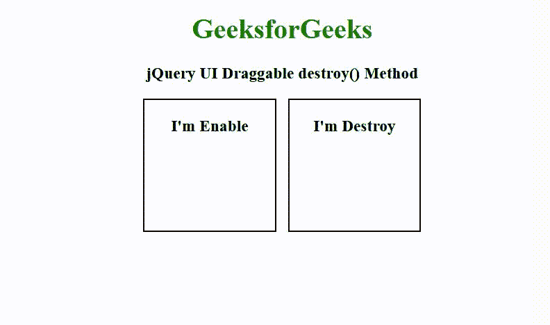

# jQuery UI 可拖动销毁()方法

> 原文:[https://www . geesforgeks . org/jquery-ui-draggable-destroy-method/](https://www.geeksforgeeks.org/jquery-ui-draggable-destroy-method/)

[jQuery UI](https://www.geeksforgeeks.org/jquery-ui-introduction/) 由 GUI 小部件、视觉效果和使用 [jQuery](https://www.geeksforgeeks.org/jquery-tutorials/) 、 [CSS、](https://www.geeksforgeeks.org/css-tutorials/)和 [HTML](https://www.geeksforgeeks.org/html-tutorials/) 实现的主题组成。jQuery 用户界面非常适合为网页构建用户界面。jQuery UI 可拖动 **destroy()** 方法用于完全移除可拖动功能。

**语法:**

```html
$( ".selector" ).draggable( "destroy" );
```

**参数:**此方法不接受任何参数。

**CDN 链接:**首先，添加项目所需的 jQuery UI 脚本。

> <link href="”https://code.jquery.com/ui/1.10.4/themes/ui-lightness/jquery-ui.css”" rel="”stylesheet”">
> <脚本 src = " https://code . jquery . com/jquery-1 . 10 . 2 . js "></脚本>
> <脚本 src = " https://code . jquery . com/ui/1 . 10 . 4/jquery-ui . js "></脚本>

**示例:**下面的示例说明了 jQuery UI 中的可拖动**销毁()**方法。

## 超文本标记语言

```html
<!doctype html>
<html lang="en">
<head>
    <link rel="stylesheet"
          href=
"https://code.jquery.com/ui/1.12.1/themes/smoothness/jquery-ui.css">
    <script src=
"https://code.jquery.com/jquery-1.12.4.js">
    </script>
    <script src=
"https://code.jquery.com/ui/1.12.1/jquery-ui.js">
    </script>
    <style>
        h1 {
            color: green;
        }
        .container{
            width: 320px;
        }
        #left-div {
            float: left;
        }
        #right-div{
            float: right;
        }
        #left-div,#right-div
        {
            width: 150px;
            height: 150px;
            text-align: center;
            border: 2px solid black;
        }
    </style>
    <script>
        $(function() {
            $( "#left-div" ).draggable();
            $( "#left-div" ).draggable('enable');
            $( "#right-div" ).draggable();
            $( "#right-div" ).draggable('destroy');    
        });
    </script>
</head>

<body>
    <center>
        <h1>GeeksforGeeks</h1>
        <h3>jQuery UI Draggable destroy() Method</h3>
        <div class="container">
            <div id="left-div">
                <h3 class="gfg">I'm Enable</h3>
            </div>
            <div id="right-div">
                <h3 class="gfg">I'm Destroy</h3>
            </div>
        </div>
    </center>
</body>
</html>
```

**输出:**

