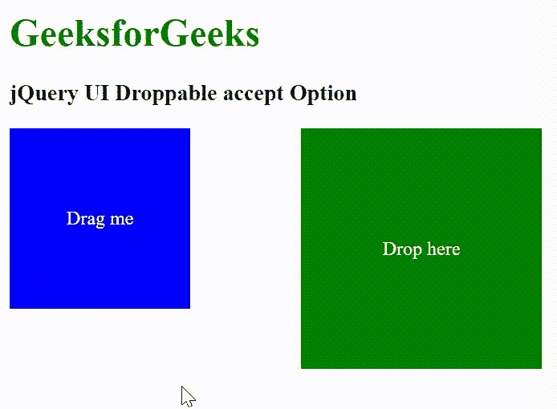

# jQuery UI 可删除接受选项

> 原文:[https://www . geesforgeks . org/jquery-ui-dropped-accept-option/](https://www.geeksforgeeks.org/jquery-ui-droppable-accept-option/)

jQuery UI 由 GUI 小部件、视觉效果和使用 jQuery、CSS 和 HTML 实现的主题组成。jQuery 用户界面非常适合为网页构建用户界面。jQuery UI 可拖放*接受*选项用于控制可拖放接受的可拖动元素。它接受一个值作为选择器或函数()。

**语法:**

```html
$( ".selector" ).droppable({
  accept: ".special"
});
```

**CDN 链接:**首先，添加项目所需的 jQuery UI 脚本。

> <link rel="”stylesheet”" href="”//code.jquery.com/ui/1.12.1/themes/smoothness/jquery-ui.css”">
> <脚本 src =//code . jquery . com/jquery-1 . 12 . 4 . js "></脚本>
> <脚本 src =//code . jquery . com/ui/1 . 12 . 1/jquery-ui . js "></脚本>

**示例:**

## 超文本标记语言

```html
<!doctype html>
<html lang="en">

<head>
    <meta charset="utf-8">
    <link rel="stylesheet" href=
    "//code.jquery.com/ui/1.12.1/themes/smoothness/jquery-ui.css">
    <script src="//code.jquery.com/jquery-1.12.4.js"></script>
    <script src="//code.jquery.com/ui/1.12.1/jquery-ui.js"></script>
    <style>
        h1 {
            color: green;
        }

        div {
            color: white;
            display: flex;
            justify-content: center;
            align-items: center;
            text-align: center;
        }

        #div2 {
            width: 150px;
            height: 150px;
            background: blue;
        }

        #div1 {
            position: absolute;
            left: 250px;
            width: 200px;
            height: 200px;
            background: green;
            color: #fff;
        }
    </style>
</head>

<body>
    <h1>GeeksforGeeks</h1>

    <h3>jQuery UI Droppable accept Option</h3>

    <div id="div1">Drop here</div>
    <div id="div2">Drag me</div>

    <script>
        $("#div2").draggable();
        $("#div1").droppable({
            accept: "#div1"
        });
    </script>
</body>

</html>
```

**输出:**



可放弃的接受选项

**参考:**T2】https://api.jqueryui.com/droppable/#option-accept