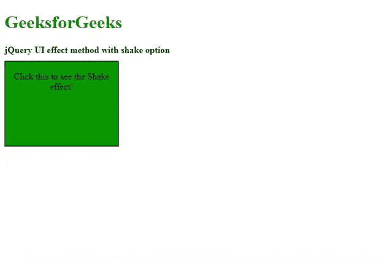

# jQuery UI |效果()方法

> 原文:[https://www.geeksforgeeks.org/jquery-ui-effect-method/](https://www.geeksforgeeks.org/jquery-ui-effect-method/)

**jQuery UI** 框架提供了**效果()**的方法，无需使用 show()和 hide()方法，即可管理所选元素上不同种类的视觉效果。有许多类型的效果作为参数传递给**效果()**方法。

**语法:**

```html
$(selector).effect(effectType[, options ] [, duration ] [, complete ]);
```

**参数:**该方法接受上述和下述四个参数:

*   **效果类型:**为所选元素的视觉过渡选择的效果类型。
*   **选项:**选项或设置用于缓和效果。
*   **持续时间:**动画效果运行的时间或持续时间，单位为毫秒。默认值为 400 毫秒。
*   **完成:**这是视觉效果完成时执行的回调函数。

**jQuery 界面链接:**

> <link>href = " https://code . jquery . com/ui/1 . 10 . 4/themes/ui-light/jquery-ui . CSS " rel = " style sheet " type = " text/CSS "/
> T4】src = " https://code . jquery . com/jquery-1 . 10 . 2 . js ">/script>

*效应类型*有多种，可根据项目要求传递到**效应()**方法。在下面的例子中，我们将只演示其中的一些以及输出图像。

**示例 1:** 以下示例演示了 jQuery UI **效果()**方法，其中*摇动*效果，选项设置为*时间*和*距离*。

```html
<!DOCTYPE html>
<html lang="en">

<head>
    <meta charset="utf-8">
    <meta name="viewport" content=
        "width=device-width, initial-scale=1">

    <title>jQuery UI effect method</title>

    <link href=
"http://code.jquery.com/ui/1.10.4/themes/ui-lightness/jquery-ui.css"
        rel="stylesheet">

    <script src=
"http://code.jquery.com/jquery-1.10.2.js">
    </script>

    <script src=
"http://code.jquery.com/ui/1.10.4/jquery-ui.js">
    </script>

    <style>
        #divID {
            width: 200px;
            height: 150px;
            text-align: center;
            background: green;
            border: 1px solid black;
        }

        .height {
            height: 10px;
        }
    </style>

    <script>
        $(document).ready(function () {
            $('#divID').click(function () {
                $("#divID").effect("shake", {
                    times: 20,
                    distance: 180
                }, 3000, function () {
                    $("#divID").css(
                        "background", "#ff0000");
                });
            });
        });  
    </script>
</head>

<body>
    <h1 style="color:green">GeeksforGeeks</h1>

    <b>jQuery UI effect method with shake option </b>

    <div class="height"> </div>

    <div id="divID">
        <span>
            Click this to see the Shake effect!
        </span>
    </div>
</body>

</html>
```

**输出:**


**示例 2:** 下面的代码演示了 jQuery UI **效果()**方法，用*分解*效果，用*缓和*设置为“摇摆”。

```html
<!DOCTYPE html>
<html lang="en">

<head>
    <meta charset="utf-8">
    <meta name="viewport" content=
            "width=device-width, initial-scale=1">

    <title>jQuery UI effect with explode </title>

    <link href=
"http://code.jquery.com/ui/1.10.4/themes/ui-lightness/jquery-ui.css"
        rel="stylesheet">

    <script src=
"http://code.jquery.com/jquery-1.10.2.js">
    </script>

    <script src=
"http://code.jquery.com/ui/1.10.4/jquery-ui.js">
    </script>

    <style>
        #divID {
            height: 200px;
            width: 200px;
            text-align: center;
            background: green;
            border: 1px solid black;
        }

        .height {
            height: 10px;
        }
    </style>

    <script>
        $(document).ready(function () {
            $('#divID').click(function () {
                $("#divID").effect({
                    effect: "explode",
                    easing: "swing",
                    pieces: 12,
                    duration: 3000
                });
            });
        });  
    </script>
</head>

<body>
    <h1 style="color:green">GeeksforGeeks</h1>

    <b>jQuery UI effect method with explode option</b>

    <div class="height"></div>

    <div id="divID">
        <span>
            Click this to see the explode effect!
        </span>
    </div>
</body>

</html>
```

**输出:**


**示例 3:** 下面的示例演示了**效果()**方法与*反弹*效果类型。

```html
<!DOCTYPE html>
<html lang="en">

<head>
    <meta charset="utf-8">
    <meta name="viewport" content=
        "width=device-width, initial-scale=1">

    <title>jQuery UI effect Method with bounce</title>

    <link href=
"http://code.jquery.com/ui/1.10.4/themes/ui-lightness/jquery-ui.css"
        rel="stylesheet">

    <script src=
"http://code.jquery.com/jquery-1.10.2.js">
    </script>

    <script src=
"http://code.jquery.com/ui/1.10.4/jquery-ui.js">
    </script>

    <style>
        #divID {
            height: 100px;
            width: 200px;
            background: green;
            text-align: center;
            border: 1px solid black;
        }

        .height {
            height: 10px;
        }
    </style>
    <script>
        $(document).ready(function () {
            $('#divID').click(function () {
                $("#divID").effect("bounce", {
                    times: 20,
                    distance: 200
                }, 3000, function () {
                    $(this).css("background", "#ff0000");
                });
            });
        });  
    </script>
</head>

<body>
    <h1 style="color:green">GeeksforGeeks</h1>
    <b>jQuery UI effect method with bounce </b>
    <div class="height"> </div>
    <div id="divID">
        <span>
            Click this to see bounce effect
        </span>
    </div>
</body>

</html>  
```

**输出:**
