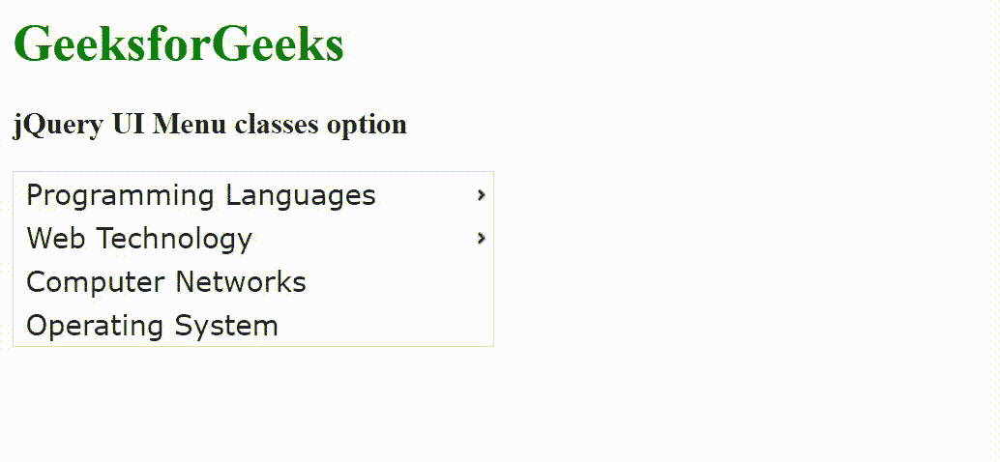

# jQuery UI 菜单类选项

> 哎哎哎::1230【https://www . geeksforgeeks . org/jquery-ui-menu-classes 选项/

jQuery UI 由 GUI 小部件、视觉效果和使用 HTML、CSS 和 jQuery 实现的主题组成。jQuery 用户界面非常适合为网页构建用户界面。jQuery 用户界面菜单类选项用于添加额外的类来添加小部件元素。

**语法:**

```
$( ".selector" ).menu({
  classes: {
    "ui-menu": "highlight"
  }
});
```

**CDN 链接:**首先，添加项目所需的 jQuery UI 脚本。

> <link rel="”stylesheet”" href="”//code.jquery.com/ui/1.12.1/themes/smoothness/jquery-ui.css”">
> <脚本 src =//code . jquery . com/jquery-1 . 12 . 4 . js "></脚本>
> <脚本 src =//code . jquery . com/ui/1 . 12 . 1/jquery-ui . js "></脚本>

**示例:**

## 超文本标记语言

```
<!doctype html>
<html lang="en">

<head>
    <meta charset="utf-8">
    <link rel="stylesheet" href=
    "//code.jquery.com/ui/1.12.1/themes/smoothness/jquery-ui.css">
    <script src="//code.jquery.com/jquery-1.12.4.js"></script>
    <script src="//code.jquery.com/ui/1.12.1/jquery-ui.js"></script>
    <style>
        .ui-menu {
            width: 300px;
        }
    </style>
</head>

<body>
    <h1 style="color: green;">GeeksforGeeks</h1>

    <h3>jQuery UI Menu classes option</h3>

    <ul id="menu">
        <li>
            <div>Programming Languages</div>
            <ul>
                <li>
                    <div>C Programming</div>
                </li>
                <li>
                    <div>C++ Programming</div>
                </li>
                <li>
                    <div>Java Programming</div>
                </li>
            </ul>
        </li>
        <li>
            <div>Web Technology</div>
            <ul>
                <li>
                    <div>HTML</div>
                </li>
                <li>
                    <div>CSS</div>
                </li>
                <li>
                    <div>JavaScript</div>
                </li>
            </ul>
        </li>
        <li>
            <div>Computer Networks</div>
        </li>
        <li>
            <div>Operating System</div>
        </li>
    </ul>

    <script>
        $("#menu").menu({
            "ui-menu": "highlight"
        });
    </script>
</body>

</html>
```

**输出:**



**参考:**[https://API . jquery ui . com/menu/# option-classes](https://api.jqueryui.com/menu/#option-classes)