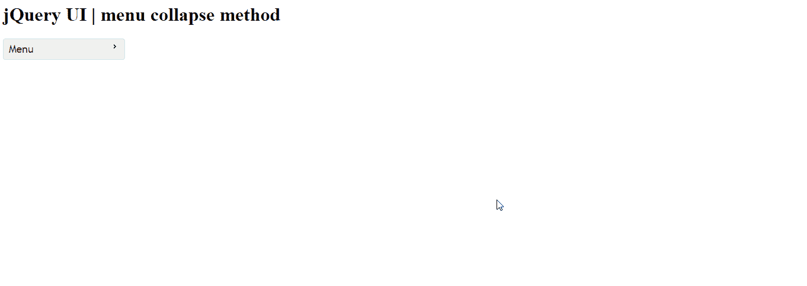
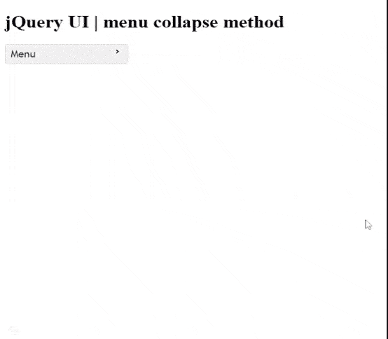

# jQuery UI 菜单折叠()方法

> 原文:[https://www . geesforgeks . org/jquery-ui-menu-collapse-method/](https://www.geeksforgeeks.org/jquery-ui-menu-collapse-method/)

**jQuery UI** 由 GUI 小部件、视觉效果和使用 jQuery、CSS 和 HTML 实现的主题组成。jQuery UI 非常适合为网页构建界面。jQuery UI 菜单是一个 them able 菜单，与鼠标和键盘交互使用，在页面之间导航*。* 在本文中，我们将使用*折叠*选项来折叠活动子菜单。

**语法:**

```html
$(".selector").menu( "collapse" );
```

**进场:**

*   首先，添加项目所需的 jQuery UI 脚本。

> <link href="“https://code.jquery.com/ui/1.10.4/themes/ui-lightness/jquery-ui.css”" rel="“stylesheet”">

**示例 1:** 在本例中，我们将使用*折叠**的***选项和**菜单()**方法。

## 超文本标记语言

```html
<!doctype html>
<html lang="en">

<head>
    <meta charset="utf-8">
    <link href=
"https://code.jquery.com/ui/1.10.4/themes/ui-lightness/jquery-ui.css"
            rel="stylesheet">
    <script src="https://code.jquery.com/jquery-1.10.2.js"></script>

    <script src="https://code.jquery.com/ui/1.10.4/jquery-ui.js">
    </script>

    <style>
        .ui-menu {
            width: 200px;
        }
    </style>

    <script>
        $(function() {
            var menu = $("#gfg").menu();
            $("#gfg").menu()
            $(menu).mouseleave(function() {
                menu.menu('collapse');
            });
        });
    </script>
</head>

<body>
    <h1>jQuery UI | menu collapse method</h1>
    <ul id="gfg">
        <li><a href="#">Menu</a>
            <ul>
                <li><a href="#">Submenu</a>
                    <ul>
                        <li><a href="#">
                            Sub-Submenu
                        </a></li>
                    </ul>
                </li>
            </ul>
        </li>
    </ul>
</body>

</html>
```

**输出:**

*   **用崩法。**



*   **无崩法。**在下图中，请注意子菜单没有像第一张图片那样折叠。

