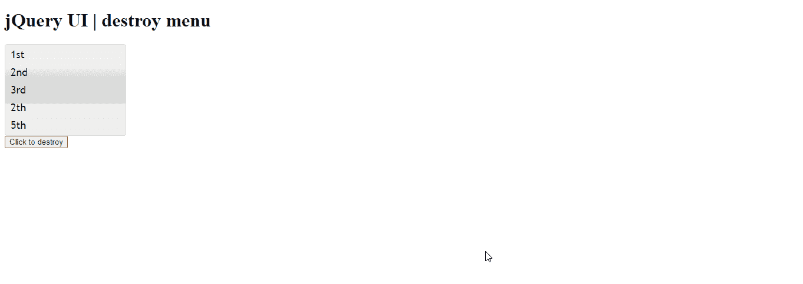

# jQuery UI 菜单销毁()方法

> 原文:[https://www . geesforgeks . org/jquery-ui-menu-destroy-method/](https://www.geeksforgeeks.org/jquery-ui-menu-destroy-method/)

jQuery 用户界面由图形用户界面小部件、视觉效果和使用 jQuery、CSS 和 HTML 实现的主题组成。jQuery 用户界面非常适合为网页构建用户界面。jQuery 用户界面菜单是一个主题菜单，它与鼠标和键盘交互一起用于在页面之间导航。在本文中，我们将展示如何在 jQuery UI 中销毁菜单。

**语法:**

```html
$(".selector").menu( "destroy" );
```

**参数:**此方法不接受任何参数。

**CDN 链接:**首先，添加项目所需的 jQuery UI 脚本。

> <link href="“https://code.jquery.com/ui/1.10.4/themes/ui-lightness/jquery-ui.css”" rel="“stylesheet”">
> <脚本 src = " https://code . jquery . com/jquery-1 . 10 . 2 . js "></脚本>
> <脚本 src = " https://code . jquery . com/ui/1 . 10 . 4/jquery-ui . js "></脚本>

**示例:**

## 超文本标记语言

```html
<!DOCTYPE html>
<html lang="en">
  <head>
    <meta charset="utf-8" />
    <link href=
"https://code.jquery.com/ui/1.10.4/themes/ui-lightness/jquery-ui.css"
      rel="stylesheet"/>
    <script src=
"https://code.jquery.com/jquery-1.10.2.js">
    </script>
    <script src=
"https://code.jquery.com/ui/1.10.4/jquery-ui.js">
    </script>
    <style>
      .ui-menu {
        width: 200px;
      }
    </style>
    <script>
      $(function () {
        $("#gfg").menu();
      });
      function gfg() {
        $("#gfg").menu("destroy");
      }
    </script>
  </head>
  <body>
    <h1>jQuery UI | destroy menu</h1>
    <ul id="gfg">
      <li><a href="https://www.geeksforgeeks.org/">1st</a></li>
      <li><a href="https://www.geeksforgeeks.org/">2nd</a></li>
      <li><a href="https://www.geeksforgeeks.org/">3rd</a></li>
      <li><a href="https://www.geeksforgeeks.org/">2th</a></li>
      <li><a href="https://www.geeksforgeeks.org/">5th</a></li>
    </ul>
    <button onclick="gfg()">Click to destroy</button>
  </body>
</html>
```

**输出:**



**参考:**T2】https://api.jqueryui.com/menu/#method-destroy