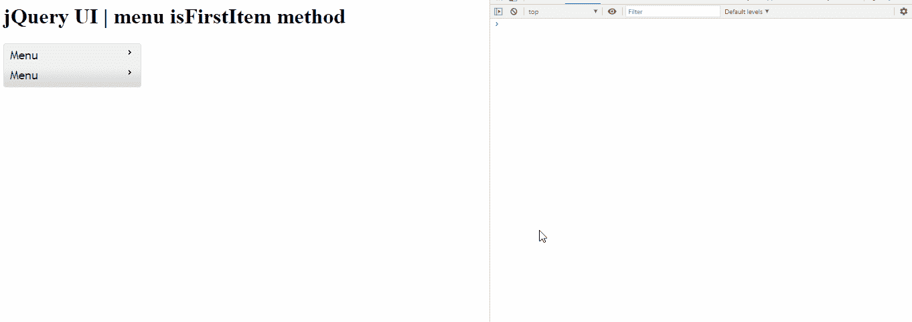

# jQuery UI 菜单 isFirstItem()方法

> 原文:[https://www . geesforgeks . org/jquery-ui-menu-isfirstitem-method/](https://www.geeksforgeeks.org/jquery-ui-menu-isfirstitem-method/)

jQuery UI 由 GUI 小部件、视觉效果和使用 jQuery、CSS 和 HTML 实现的主题组成。jQuery 用户界面非常适合为网页构建用户界面。jQuery UI 菜单是一个 菜单，用于鼠标和键盘交互在页面之间导航*。*jQuery UI**isFirstItem()**方法用于检查菜单项是否为其第一项，相应返回布尔值。

**语法:**

```html
$(".selector").menu( "isFirstItem" );
```

**进场:**

*   首先，添加项目所需的 jQuery UI 脚本。

> <link href="“https://code.jquery.com/ui/1.10.4/themes/ui-lightness/jquery-ui.css”" rel="“stylesheet”">

**示例:**在本例中，我们将使用 isFirstItem 方法。

## 超文本标记语言

```html
<!doctype html>
<html lang="en">

<head>
    <meta charset="utf-8">
    <link href=
"https://code.jquery.com/ui/1.10.4/themes/ui-lightness/jquery-ui.css"
        rel="stylesheet">
    <script src="https://code.jquery.com/jquery-1.10.2.js"></script>

    <script src="https://code.jquery.com/ui/1.10.4/jquery-ui.js">
    </script>

    <style>
        .ui-menu {
            width: 200px;
        }
    </style>

    <script>
        $(function() {
            var menu = $("#gfg").menu();
            $("#gfg").menu()
        });

        function chck() {
            var a = $("#gfg").menu("isFirstItem");
            console.log(a)
        }
    </script>
</head>

<body>
    <h1>jQuery UI | menu isFirstItem method</h1>
    <ul id="gfg">
        <li><a href="#" onclick="chck()">Menu</a>
            <ul>
                <li><a href="#" onclick="chck()">
                    Submenu
                </a></li>
            </ul>
        </li>
        <li><a href="#" onclick="chck()">Menu</a>
            <ul>
                <li><a href="#" onclick="chck()">
                    Submenu
                </a></li>
                <li><a href="#" onclick="chck()">
                    Submenu
                </a></li>
            </ul>
        </li>
    </ul>
</body>

</html>
```

**输出:**在控制台中我们可以看到每个菜单项对应的布尔值。

