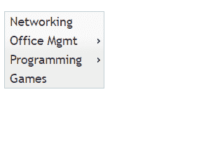
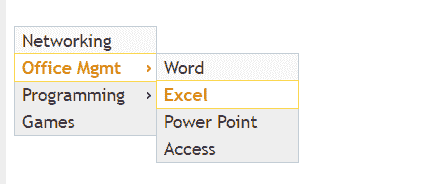
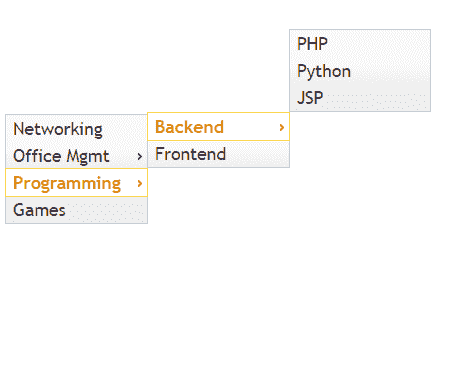

# jquery ui |功能表

> 哎哎哎:# t0]https://www . geeksforgeeks . org/jquery-ui-menu/

jQuery UI 中的菜单小部件创建一个菜单，该菜单包含子菜单中与菜单上特定项目相关的项目和子项目。菜单项是使用标记元素创建的，标记元素使用类似父子的关系，可以使用列表和嵌套列表来创建。每个菜单项通常对应于一个特定的页面，因此每个元素都位于一个锚定的标签之间。

**语法:**

```
$(selector, context).menu(options)
```

您可以使用 JavaScript 对象一次提供一个或多个选项。

如果要提供的选项不止一个，您可以用逗号将它们分开，如下所示

```
$(selector, context).menu ("action", params)
```

对于导航，我们可以使用 jQuery UI 创建一个菜单。我们可以使用菜单创建主菜单和子菜单。我们将在 HTML 中创建一个列表和子列表，这将用于使用 jQuery 用户界面创建菜单。

*   **Width of the menu:** According to your layout and style, the menu may take different width, we may require to adjust the width so we can keep this style properties inside our head tag.

    **例 1:**

    ```
    <!DOCTYPE html>
    <html>

    <head>
        <link href=
    'https://ajax.googleapis.com/ajax/libs/jqueryui/1.12.1/themes/ui-lightness/jquery-ui.css'
            rel='stylesheet'>

        <script src=
    "https://ajax.googleapis.com/ajax/libs/jquery/3.1.1/jquery.min.js">
        </script>

        <script src=
    "https://ajax.googleapis.com/ajax/libs/jqueryui/1.12.1/jquery-ui.min.js">
        </script>

        <style>
            .ui-menu {
                width: 8em;
            }
        </style>
    </head>

    <body>
        <br><br>

        <ul id='my_cs_menu'>
            <li>
                <div>Networking</div>
            </li>

            <li>
                <div>Office Mgmt</div>
                <ul>
                    <li>
                        <div>Word</div>
                    </li>
                    <li>
                        <div>Excel</div>
                    </li>
                    <li>
                        <div>Power Point</div>
                    </li>
                    <li>
                        <div>Access</div>
                    </li>
                </ul>
            </li>

            <li>
                <div>Programming</div>
                <ul>
                    <li>
                        <div>Backend</div>
                        <ul>
                            <li>
                                <div>PHP</div>
                            </li>
                            <li>
                                <div>Python</div>
                            </li>
                            <li>
                                <div>JSP</div>
                            </li>
                        </ul>
                    </li>
                    <li>
                        <div>Frontend</div>
                    </li>
                </ul>
            </li>

            <li>
                <div>Games</div>
            </li>
        </ul>

        <script>
            $(document).ready(function() {
                $("#my_cs_menu").menu();
            })
        </script>
    </body>

    </html>
    ```

    <video class="wp-video-shortcode" id="video-364201-1" width="665" height="374" preload="metadata" controls=""><source type="video/mp4" src="https://media.geeksforgeeks.org/wp-content/uploads/20191202232456/menu.html-Google-Chrome-2019-12-02-23-23-31.mp4?_=1">[https://media.geeksforgeeks.org/wp-content/uploads/20191202232456/menu.html-Google-Chrome-2019-12-02-23-23-31.mp4](https://media.geeksforgeeks.org/wp-content/uploads/20191202232456/menu.html-Google-Chrome-2019-12-02-23-23-31.mp4)</video>
*   **Disabling Menu:** We can disable a menu by using the **disable** option and setting its value to **true**. By default, the value is set as false.

    **例 2:**

    ```
    <!DOCTYPE html>
    <html>

    <head>
        <link href=
    'https://ajax.googleapis.com/ajax/libs/jqueryui/1.12.1/themes/ui-lightness/jquery-ui.css'
            rel='stylesheet'>

        <script src=
    "https://ajax.googleapis.com/ajax/libs/jquery/3.1.1/jquery.min.js">
        </script>

        <script src=
    "https://ajax.googleapis.com/ajax/libs/jqueryui/1.12.1/jquery-ui.min.js">
        </script>

        <style>
            .ui-menu {
                width: 8em;
            }
        </style>
    </head>

    <body>
        <br><br>

        <ul id='my_cs_menu'>
            <li>
                <div>Networking</div>
            </li>

            <li>
                <div>Office Mgmt</div>
                <ul>
                    <li>
                        <div>Word</div>
                    </li>
                    <li>
                        <div>Excel</div>
                    </li>
                    <li>
                        <div>Power Point</div>
                    </li>
                    <li>
                        <div>Access</div>
                    </li>
                </ul>
            </li>

            <li>
                <div>Programming</div>
                <ul>
                    <li>
                        <div>Backend</div>
                        <ul>
                            <li>
                                <div>PHP</div>
                            </li>
                            <li>
                                <div>Python</div>
                            </li>
                            <li>
                                <div>JSP</div>
                            </li>
                        </ul>
                    </li>
                    <li>
                        <div>Frontend</div>
                    </li>
                </ul>
            </li>

            <li>
                <div>Games</div>
            </li>
        </ul>

        <script>
            $(document).ready(function() {
                $("#my_cs_menu").menu({
                    disabled: true
                });
            })
        </script>
    </body>

    </html>
    ```

    

*   **Icons:** To point to sub-menus from the main-menu we can use icons. We can change the icons as per our choice. We can assign other values like: *ui-icon-circle-triangle-e, ui-icon-arrow-1-e, ui-icon-arrowthick-1-e, ui-icon-triangle-1-e*

    **例 3:**

    ```
    <!DOCTYPE html>
    <html>

    <head>
        <link href=
    'https://ajax.googleapis.com/ajax/libs/jqueryui/1.12.1/themes/ui-lightness/jquery-ui.css'
            rel='stylesheet'>

        <script src=
    "https://ajax.googleapis.com/ajax/libs/jquery/3.1.1/jquery.min.js">
        </script>

        <script src=
    "https://ajax.googleapis.com/ajax/libs/jqueryui/1.12.1/jquery-ui.min.js">
        </script>

        <style>
            .ui-menu {
                width: 8em; 
            }
        </style>
    </head>

    <body>
        <ul id='my_cs_menu'>
            <li>
                <div>Networking</div>
            </li>

            <li>
                <div>Office Mgmt</div>
                <ul>
                    <li>
                        <div>Word</div>
                    </li>
                    <li>
                        <div>Excel</div>
                    </li>
                    <li>
                        <div>Power Point</div>
                    </li>
                    <li>
                        <div>Access</div>
                    </li>
                </ul>
            </li>

            <li>
                <div>Programming</div>

                <ul>
                    <li>
                        <div>Backend</div>
                        <ul>
                            <li>
                                <div>PHP</div>
                            </li>
                            <li>
                                <div>Python</div>
                            </li>
                            <li>
                                <div>JSP</div>
                            </li>
                        </ul>
                    </li>
                    <li>
                        <div>Frontend</div>
                    </li>
                </ul>
            </li>

            <li>
                <div>Games</div>
            </li>
        </ul>

        <script>
            $(document).ready(function() {
                $("#my_cs_menu").menu({
                    menus: 'ul'
                });
            })
        </script>
    </body>

    </html>
    ```

    

*   **Menus:** We can set the selector for the menu elements. By default, it is *ul*, we can change this value to other elements like *div*.

    **注意:**输出将保持与示例 2 相同。

    **例 4:**

    ```
    <!DOCTYPE html>
    <html>

    <head>
        <link href=
    'https://ajax.googleapis.com/ajax/libs/jqueryui/1.12.1/themes/ui-lightness/jquery-ui.css'
            rel='stylesheet'>

        <script src=
    "https://ajax.googleapis.com/ajax/libs/jquery/3.1.1/jquery.min.js">
        </script>

        <script src=
    "https://ajax.googleapis.com/ajax/libs/jqueryui/1.12.1/jquery-ui.min.js">
        </script>

        <style>
            .ui-menu {
                width: 8em;
            }
        </style>
    </head>

    <body>
        <ul id='my_cs_menu'>
            <li>
                <div>Networking</div>
            </li>
            <li>
                <div>Office Mgmt</div>
                <ul>
                    <li>
                        <div>Word</div>
                    </li>
                    <li>
                        <div>Excel</div>
                    </li>
                    <li>
                        <div>Power Point</div>
                    </li>
                    <li>
                        <div>Access</div>
                    </li>
                </ul>
            </li>
            <li>
                <div>Programming</div>

                <ul>
                    <li>
                        <div>Backend</div>
                        <ul>
                            <li>
                                <div>PHP</div>
                            </li>
                            <li>
                                <div>Python</div>
                            </li>
                            <li>
                                <div>JSP</div>
                            </li>
                        </ul>
                    </li>
                    <li>
                        <div>Frontend</div>
                    </li>
                </ul>
            </li>

            <li>
                <div>Games</div>
            </li>
        </ul>

        <script>
            $(document).ready(function() {
                $("#my_cs_menu").menu({
                    menus: 'ul'
                });
            })
        </script>
    </body>

    </html>
    ```

    

*   **Position in Menu:** We can set the position of the sub-menu relative to main menu by setting the position value.
    Here we have used this position value to set the position of sub-menu list.

    ```
    position: { my: "left bottom", at: "right top" }
    ```

    *   ***我的:*** 是工具提示框。
    *   *显示工具提示的元素。*
    *   *所有水平对齐可以采取三个位置:*左侧*、*右侧*或*中心**
    *   *所有垂直校准可采取三个位置:*顶部*或*底部*或*中心**

    ***例 5:***

    ```
    *<!DOCTYPE html>
    <html>

    <head>
        <link href=
    'https://ajax.googleapis.com/ajax/libs/jqueryui/1.12.1/themes/ui-lightness/jquery-ui.css'
            rel='stylesheet'>

        <script src=
    "https://ajax.googleapis.com/ajax/libs/jquery/3.1.1/jquery.min.js">
        </script>

        <script src=
    "https://ajax.googleapis.com/ajax/libs/jqueryui/1.12.1/jquery-ui.min.js">
        </script>

        <style>
            .ui-menu {
                width: 8em;
            }
        </style>
    </head>

    <body>
        <br><br><br><br><br><br>

        <ul id='my_cs_menu'>
            <li>
                <div>Networking</div>
            </li>
            <li>
                <div>Office Mgmt</div>
                <ul>
                    <li>
                        <div>Word</div>
                    </li>
                    <li>
                        <div>Excel</div>
                    </li>
                    <li>
                        <div>Power Point</div>
                    </li>
                    <li>
                        <div>Access</div>
                    </li>
                </ul>
            </li>
            <li>
                <div>Programming</div>

                <ul>
                    <li>
                        <div>Backend</div>
                        <ul>
                            <li>
                                <div>PHP</div>
                            </li>
                            <li>
                                <div>Python</div>
                            </li>
                            <li>
                                <div>JSP</div>
                            </li>
                        </ul>
                    </li>
                    <li>
                        <div>Frontend</div>
                    </li>
                </ul>
            </li>

            <li>
                <div>Games</div>
            </li>
        </ul>

        <script>
            $(document).ready(function() {
                $("#my_cs_menu").menu({
                    position: {
                        my: "left bottom",
                        at: "right top"
                    }
                });
            })
        </script>
    </body>

    </html>*
    ```

    **

*   ***Blur:** We can Trigger any script by associating it with blur method of menu. In the below example, We will collect the name of the element from which we just moved out by using blur method.

    **例 6:**

    ```
    <!DOCTYPE html>
    <html>

    <head>
        <link href=
    'https://ajax.googleapis.com/ajax/libs/jqueryui/1.12.1/themes/ui-lightness/jquery-ui.css'
            rel='stylesheet'>

        <script src=         
    "https://ajax.googleapis.com/ajax/libs/jquery/3.1.1/jquery.min.js">
        </script>

        <script src=
    "https://ajax.googleapis.com/ajax/libs/jqueryui/1.12.1/jquery-ui.min.js">
        </script>

        <style>
            .ui-menu {
                width: 8em;
            }
        </style>
    </head>

    <body>
        <br><br><br><br>

        <div id=display></div>

        <br><br>

        <ul id='my_cs_menu'>
            <li>
                <div>Networking</div>
            </li>
            <li>
                <div>Office Mgmt</div>
                <ul>
                    <li>
                        <div>Word</div>
                    </li>
                    <li>
                        <div>Excel</div>
                    </li>
                    <li>
                        <div>Power Point</div>
                    </li>
                    <li>
                        <div>Access</div>
                    </li>
                </ul>
            </li>
            <li>
                <div>Programming</div>

                <ul>
                    <li>
                        <div>Backend</div>
                        <ul>
                            <li>
                                <div>PHP</div>
                            </li>
                            <li>
                                <div>Python</div>
                            </li>
                            <li>
                                <div>JSP</div>
                            </li>
                        </ul>
                    </li>
                    <li>
                        <div>Frontend</div>
                    </li>
                </ul>
            </li>
            <li>
                <div>Games</div>
            </li>
        </ul>

        <script>
            $(document).ready(function() {
                $("#my_cs_menu").menu({
                    blur: function(event, ui) {
                        $('#display').html(" <b>Moved From: </b>"
                                + ui.item.text());
                    }
                });
            })
        </script>
    </body>

    </html>
    ```

    <video class="wp-video-shortcode" id="video-364201-2" width="665" height="374" preload="metadata" controls=""><source type="video/mp4" src="https://media.geeksforgeeks.org/wp-content/uploads/20191203003343/menu5-blur.html-Google-Chrome-2019-12-03-00-32-24.mp4?_=2">[https://media.geeksforgeeks.org/wp-content/uploads/20191203003343/menu5-blur.html-Google-Chrome-2019-12-03-00-32-24.mp4](https://media.geeksforgeeks.org/wp-content/uploads/20191203003343/menu5-blur.html-Google-Chrome-2019-12-03-00-32-24.mp4)</video>*
*   ***Destroy:** We can apply destroy event and remove the functionality of menu and initiate the menu again by using click event of radio button.

    **例 7:**

    ```
    <!DOCTYPE html>
    <html>

    <head>
        <link href=
    'https://ajax.googleapis.com/ajax/libs/jqueryui/1.12.1/themes/ui-lightness/jquery-ui.css'
            rel='stylesheet'>

        <script src=
    "https://ajax.googleapis.com/ajax/libs/jquery/3.1.1/jquery.min.js">
        </script>

        <script src=
    "https://ajax.googleapis.com/ajax/libs/jqueryui/1.12.1/jquery-ui.min.js">
        </script>

        <style>
            .ui-menu {
                width: 8em;
            }
        </style>
    </head>

    <body>
        <br><br><br><br>

        <div id=display>Display here</div>
        <br><br>

        <input type='radio'
            name='r_select'
            id='r2'
            value='destroy'>destroy

        <input type='radio'
            name='r_select'
            id='r2'
            value='initialize'>initialize
        <br>

        <div id=display></div>
        <br><br>

        <ul id='my_cs_menu'>
            <li>
                <div>Networking</div>
            </li>
            <li>
                <div>Office Mgmt</div>
                <ul>
                    <li>
                        <div>Word</div>
                    </li>
                    <li>
                        <div>Excel</div>
                    </li>
                    <li>
                        <div>Power Point</div>
                    </li>
                    <li>
                        <div>Access</div>
                    </li>
                </ul>
            </li>
            <li>
                <div>Programming</div>

                <ul>
                    <li>
                        <div>Backend</div>
                        <ul>
                            <li>
                                <div>PHP</div>
                            </li>
                            <li>
                                <div>Python</div>
                            </li>
                            <li>
                                <div>JSP</div>
                            </li>
                        </ul>
                    </li>
                    <li>
                        <div>Frontend</div>
                    </li>
                </ul>
            </li>

            <li>
                <div>Games</div>
            </li>
        </ul>

        <script>
            $(document).ready(function() {
                $("#my_cs_menu").menu({
                });

                $("input:radio[name=r_select]").click(function() {
                    var selection = $(this).val()

                    if (selection == 'destroy') {
                        $("#my_cs_menu").menu(selection);
                        $('#display').html(
                            " <b>destroy method invoked</b>");
                    }
                    if (selection == 'initialize') {
                        $("#my_cs_menu").menu();
                        $('#display').html(
                            " <b>Menu Initialized</b>");
                    }
                })
            })
        </script>
    </body>

    </html>
    ```

    <video class="wp-video-shortcode" id="video-364201-3" width="665" height="374" preload="metadata" controls=""><source type="video/mp4" src="https://media.geeksforgeeks.org/wp-content/uploads/20191203005822/menu6-destroy.html-Google-Chrome-2019-12-03-00-56-51.mp4?_=3">[https://media.geeksforgeeks.org/wp-content/uploads/20191203005822/menu6-destroy.html-Google-Chrome-2019-12-03-00-56-51.mp4](https://media.geeksforgeeks.org/wp-content/uploads/20191203005822/menu6-destroy.html-Google-Chrome-2019-12-03-00-56-51.mp4)</video>*