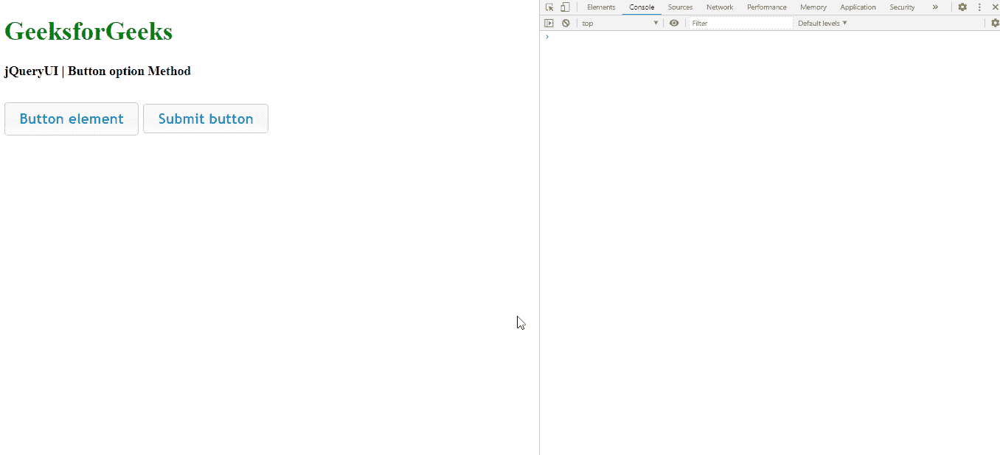

# jQuery UI 选项(选项名)方法

> 原文:[https://www . geesforgeks . org/jquery-ui-option-option name-method/](https://www.geeksforgeeks.org/jquery-ui-option-optionname-method/)

jQuery UI 选项(optionName)方法用于检查方法是否返回一个布尔值，该值表示对象选项是否存在。

**语法:**

```html
$( ".selector" ).button( "option","optionName" )
```

**参数:**

*   **选项名称:**要检查的选项。

**返回值:** 这个方法返回一个布尔值。

*   **jQuery 用户界面库的链接:**

> <链接 rel=样式表’
> *【href = " http://Ajax . Google APIs . com/Ajax/libs/jqueryui/1 . 8 . 16/themes/ui-light/jquery-ui . CSS ">*

*   ***或***

> *<链接 rel=样式表’
> *href = " https://code . jquery . com/ui/1 . 10 . 4/themes/ui-lightness/jquery-ui . CSS ">
> <脚本 src = " https://"**

*下面是显示此方法实现的示例。*

***例 1:***

## *超文本标记语言*

```html
*<!DOCTYPE html> 
<html> 

<head> 
    <meta charset="utf-8"> 
    <meta name="viewport" content= 
        "width=device-width, initial-scale=1"> 

    <script src= 
"https://ajax.googleapis.com/ajax/libs/jquery/1.7.1/jquery.js"> 
    </script> 

    <script src= 
"https://ajax.googleapis.com/ajax/libs/jqueryui/1.8.16/jquery-ui.js"> 
    </script> 

    <link href= 
"http://ajax.googleapis.com/ajax/libs/jqueryui/1.8.16/themes/ui-lightness/jquery-ui.css"
        rel="stylesheet" type="text/css" /> 

    <style> 
        .height { 
            height: 10px; 
        } 
    </style> 

    <script> 
        $(function () { 
            $("#buttonId, #submitId").button();

            $('#buttonId, #submitId').click(function (event) { 
                event.preventDefault(); 
                var a = $( this ).button( "option", "disabled" );
                console.log(a) 
            });  
        }); 
    </script> 
</head> 

<body> 
    <h1 style="color:green">GeeksforGeeks</h1> 
    <b>jQueryUI | Button option Method</b> 
    <div class="height"> </div><br> 
    <div class="buttons-div"> 
        <button id="buttonId">Button element</button> 
        <input id="submitId" type="submit" value="Submit button">  
    </div> 

</body> 

</html>*
```

***输出:***

**

***参考:**[https://API . jquery ui . com/button/](https://api.jqueryui.com/button/)*