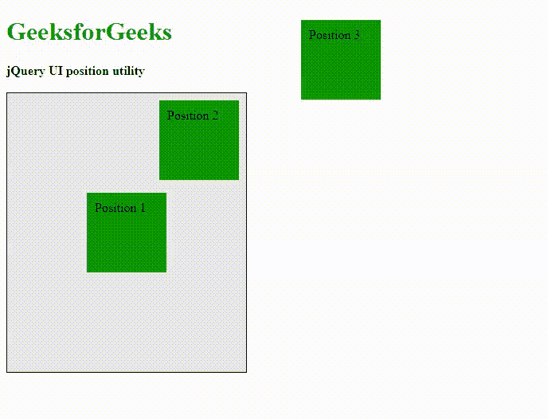
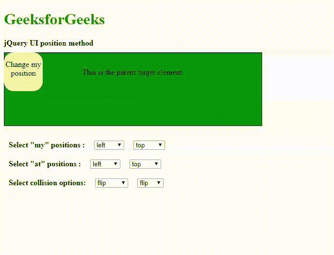

# jQuery UI |位置()方法

> 原文:[https://www.geeksforgeeks.org/jquery-ui-position-method/](https://www.geeksforgeeks.org/jquery-ui-position-method/)

**jQuery UI** 框架为用户提供了很多实用功能，其中之一就是**位置()**方法。 **position()** 方法有助于相对于页面中的任何目标元素定位任何元素，如窗口、任何父元素、文档或鼠标。它基于“顶部”、“左侧”、“右侧”和“底部”等属性来描述任何元素的位置。
**注:**

*   它不支持隐藏元素定位功能。
*   只有子元素相对于任何其他元素或目标进行定位。

**语法:**

```html
$(selector).position( options )
```

其中*选项*属于定义元素相对于目标或父元素的位置的对象类型。我们只解释其中几个常用的:
**选项:**

*   **my:** 是字符串类型。该选项提到元素的位置，需要与父目标元素对齐。其默认值为*中心。*
*   **at:** 为字符串类型。此选项提及子元素所针对的父目标元素的位置。其默认值为*中心。*
*   **of:** 类型是选择器或父元素。此选项会提到要相对其定位的父元素或目标元素。其默认值为*空值*。
*   **碰撞:**为弦式。此选项提及当定位元素超出文档窗口时应用的规则。默认值为*翻转*。

**jQuery 用户界面链接:**

> <link>href = " http://Ajax . Google APIs . com/Ajax/libs/jquery ui/1 . 8 . 16/themes/ui-light/jquery-ui . CSS " rel = " style sheet " type = " text/CSS "/>t1]

**示例 1:** 在下面的示例中，演示了基本默认的**位置()**方法。“divide 1”和“divide 2”相对于父元素“mainDivID”的“my”和“at”位置是固定的。鼠标事件为“divide 3”处理。该位置设计为在文档周围移动，在左侧和顶部保持 10°的间隙。

## 超文本标记语言

```html
<!DOCTYPE html>
<html lang="en">

<head>
    <meta charset="utf-8">
    <meta name="viewport"
          content="width=device-width, initial-scale=1">
    <title>jQuery UI position method</title>
    <link href=
"http://code.jquery.com/ui/1.10.4/themes/ui-lightness/jquery-ui.css"
          rel="stylesheet">
    <script src="http://code.jquery.com/jquery-1.10.2.js"></script>
    <script src="http://code.jquery.com/ui/1.10.4/jquery-ui.js"></script>

    <style>
        .class {
            .height: 10px;
        }

        .subDivClass {
            position: absolute;
            width: 80px;
            height: 80px;
            background: green;
            padding: 10px 10px;
        }

        #mainDivID {
            width: 300px;
            height: 300px;
            padding-top: 50px;
            background: #e9e9e9;
            border: 1px solid black
        }
    </style>
    <script>
        $(function() {
            // Position to the center with repect to the parent mainDivID
            $("#divID1").position({
                my: "center",
                at: "center",
                of: "#mainDivID"
            });
            // Position to the  top right keeping a gap of 10
            $("#divID2").position({
                my: "right-10 top+10",
                at: "right top",
                of: "#mainDivID"
            });
            /* Position to move around
            keeping a gap of 10 at the left and top */
            $(document).mousemove(function(event) {
                $("#divID3").position({
                    my: "left+10 top+10",
                    of: event,
                    collision: "fit"
                });
            });
        });
    </script>
</head>

<body>
    <h1 style="color:green">GeeksforGeeks</h1>
    <b>jQuery UI position utility </b>
    <div class="height"> </div>
    <div id="mainDivID">
        <div class="subDivClass" id="divID1">Position 1</div>
        <div class="subDivClass" id="divID2">Position 2</div>
        <div class="subDivClass" id="divID3">Position 3</div>
    </div>
</body>

</html>
```

**输出:**



**示例 2:** 在下面的示例代码中**位置**方法与所有上述选项或参数一起演示。

## 超文本标记语言

```html
<!DOCTYPE html>
<html lang="en">

<head>
    <meta charset="utf-8">
    <meta name="viewport"
          content="width=device-width, initial-scale=1">
    <title>jQuery UI position method</title>
    <link href=
"http://code.jquery.com/ui/1.10.4/themes/ui-lightness/jquery-ui.css"
          rel="stylesheet">
    <script src="http://code.jquery.com/jquery-1.10.2.js"></script>
    <script src="http://code.jquery.com/ui/1.10.4/jquery-ui.js"></script>

    <style>
        .height {
            height: 10px;
        }

        #parentDivID {
            width: 500px;
            height: 120px;
            padding: 15px;
            border: 1px solid black;
            background-color: green;
            text-align: center;
        }

        .positionableClass {
            position: absolute;
            display: block;
            border-radius: 25%;
            background-color: #e9e9e9;
            text-align: center;
        }

        #positionableId {
            width: 80px;
            height: 80px;
        }

        #optionsDivID {
            padding: 10px;
            margin-top: 20px;
        }

        .selectDiv {
            padding-bottom: 20px;
        }

        select {
            margin-left: 15px;
        }
    </style>
    <script>
        $(function() {
            function position() {
                $(".positionableClass").position({

                    my: $("#myHorizontalID").val() +
                  " " + $("#myVerticalID").val(),
                    at: $("#atHorizontalID").val()
                  + " " + $("#atVerticalID").val(),
                    of: $("#parentDivID"),
                    collision: $("#collHorizontalID").val() +
                  " " + $("#collVerticalID").val()

                });
            }

            $("select").on("click keyup change", position);

            $("#parentDivID").draggable({
                drag: position
            });

            position();
        });
    </script>
</head>

<body>
    <h1 style="color:green">GeeksforGeeks</h1>
    <b>jQuery UI position method </b>
    <div class="height"> </div>

    <div id="parentDivID">

<p>
            This is the parent target element.
        </p>

    </div>

    <div class="positionableClass" id="positionableId">

<p>
            Change my position
        </p>

    </div>

    <div id="optionsDivID">

        <div class="selectDiv">
            <b>Select "my" positions :</b>
            <select id="myHorizontalID">
                <option value="left">left</option>
                <option value="center">center</option>
                <option value="right">right</option>
            </select>
            <select id="myVerticalID">
                <option value="top">top</option>
                <option value="center">center</option>
                <option value="bottom">bottom</option>
            </select>
        </div>
        <div class="selectDiv">
            <b>Select "at" positions :</b>
            <select id="atHorizontalID">
                <option value="left">left</option>
                <option value="center">center</option>
                <option value="right">right</option>
            </select>
            <select id="atVerticalID">
                <option value="top">top</option>
                <option value="center">center</option>
                <option value="bottom">bottom</option>
            </select>
        </div>
        <div class="selectDiv">
            <b>Select collision options:</b>
            <select id="collHorizontalID">
                <option value="flip">flip</option>
                <option value="fit">fit</option>
                <option value="flipfit">flipfit</option>
                <option value="none">fit none</option>
            </select>
            <select id="collVerticalID">
                <option value="flip">flip</option>
                <option value="fit">fit</option>
                <option value="flipfit">flipfit</option>
                <option value="none">none</option>
            </select>
        </div>
    </div>

</body>

</html>
```

**输出:**

