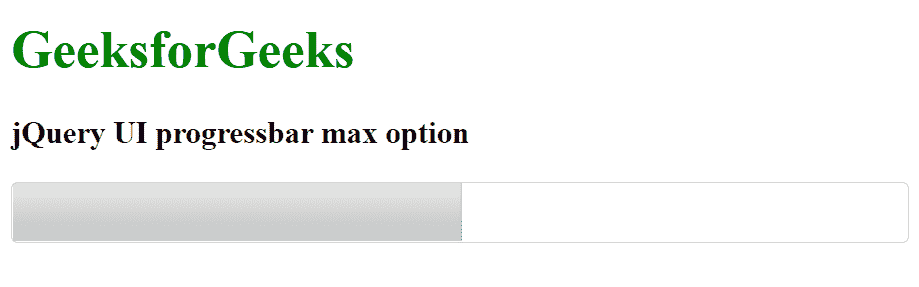

# jquery ui progress bar 最大选项

> 哎哎哎:# t0]https://www . geeksforgeeks . org/jquery-ui progress bar-max 选项/

jQuery UI 由 GUI 小部件、视觉效果和使用 HTML、CSS 和 jQuery 实现的主题组成。jQuery 用户界面非常适合为网页构建用户界面。jQuery UI Progressbar max 选项用于设置进度条的最大值。它的默认值 id 为 0。

**语法:**

```
$( ".selector" ).progressbar({
  max: val
});
```

**CDN 链接:**首先，添加项目所需的 jQuery UI 脚本。

> <link rel="”stylesheet”" href="”//code.jquery.com/ui/1.12.1/themes/smoothness/jquery-ui.css”">
> <脚本 src =//code . jquery . com/jquery-1 . 12 . 4 . js "></脚本>
> <脚本 src =//code . jquery . com/ui/1 . 12 . 1/jquery-ui . js "></脚本>

**示例:**

## 超文本标记语言

```
<!doctype html>
<html lang="en">

<head>
    <meta charset="utf-8">
    <link rel="stylesheet" href=
    "//code.jquery.com/ui/1.12.1/themes/smoothness/jquery-ui.css">
    <script src="//code.jquery.com/jquery-1.12.4.js"></script>
    <script src="//code.jquery.com/ui/1.12.1/jquery-ui.js"></script>
</head>

<body>
    <h1 style="color: green;">GeeksforGeeks</h1>

    <h3>jQuery UI progressbar max option</h3>

    <div id="GFG"></div>

    <script>
        $("#GFG").progressbar({
            max: 50,
            value: 25
        });
    </script>
</body>

</html>
```

**输出:**



**参考:**[https://API . jquery ui . com/progress bar/# option-max](https://api.jqueryui.com/progressbar/#option-max)