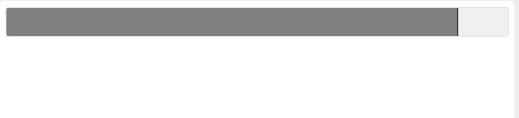

# JQuery UI | Progressbar 方法

> 原文:[https://www.geeksforgeeks.org/jquery-ui-progressbar-method/](https://www.geeksforgeeks.org/jquery-ui-progressbar-method/)

Jquery UI(用户界面)是建立在 jQuery JavaScript 库之上的 JavaScript 库。它是建立在 jQuery JavaScript 库之上的用户界面交互、效果、小部件和主题的集合。

**进度条**告诉我们任务完成的百分比以及还剩多少。它是一个图形用户界面小部件，在用户和系统之间创建一种交互。
进度条有两种类型

*   确定进度条
*   不确定进度条

**语法:**
progress bar()方法有两种形式，每种形式的使用取决于需求。这些措施如下

```
$(selector, context).progressbar (options)
```

```
$(selector, context).progressbar ("action", params)
```

**下表显示了该方法可以使用的不同选项:**

| 选择权 | 目的 |
| 有缺陷的 | 当进度条禁用设置为真时。默认情况下，它的值为 false。 |
| 最大 | 进度条的最大值。默认情况下，其值为 100。 |
| 价值 | 进度条的初始值。默认情况下，其值为 0。 |

**示例:**下面是上面解释的方法的实现:

```
<!DOCTYPE html>
<html>

<head>
    <title>my progressbar</title>
    <link rel="stylesheet" 
          type="text/css" 
href="https://code.jquery.com/ui/1.10.4/themes/ui-lightness/jquery-ui.css">

    <script type="text/javascript" 
            src="https://code.jquery.com/jquery-1.10.2.js">
    </script>

    <script type="text/javascript" 
            src="https://code.jquery.com/ui/1.10.4/jquery-ui.js">
    </script>

    <style type="text/css">
        .ui-widget-header {
            background: gray;
            border: 1px solid black;
        }
    </style>
    <script>
        $(function() {
            $("#progressbar").progressbar({
                value: 90

            });
        });
    </script>

</head>

<body>
    <div id="progressbar">
    </div>
</body>

</html>
```

**输出:**
