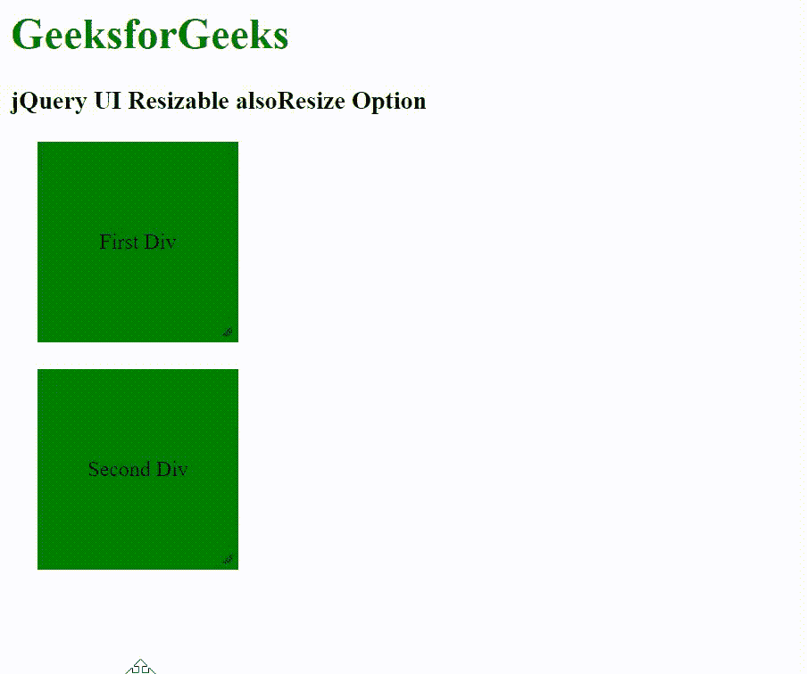

# jQuery 用户界面可调整大小也可调整大小选项

> 原文:[https://www . geesforgeks . org/jquery-ui-resizable-also resize-option/](https://www.geeksforgeeks.org/jquery-ui-resizable-alsoresize-option/)

jQuery 用户界面由图形用户界面小部件、视觉效果和使用 jQuery、CSS 和 HTML 实现的主题组成。jQuery 用户界面非常适合为网页构建用户界面。jQuery UI 可调整大小选项用于与可调整大小的元素同步调整一个或多个元素的大小。它保存选择器、jQuery 或元素，默认值为假。

**语法:**

```
$(".selector").resizable({
    alsoResize: "#mirror"
});
```

**CDN 链接:**首先，添加项目所需的 jQuery UI 脚本。

> <link rel="”stylesheet”" href="”//code.jquery.com/ui/1.12.1/themes/smoothness/jquery-ui.css”">
> <脚本 src =//code . jquery . com/jquery-1 . 12 . 4 . js "></脚本>
> <脚本 src =//code . jquery . com/ui/1 . 12 . 1/jquery-ui . js "></脚本>

**示例:**

## 超文本标记语言

```
<!doctype html>
<html lang="en">

<head>
    <meta charset="utf-8">
    <link rel="stylesheet" href=
"//code.jquery.com/ui/1.12.1/themes/smoothness/jquery-ui.css">
    <script src=
"//code.jquery.com/jquery-1.12.4.js">
    </script>
    <script src=
"//code.jquery.com/ui/1.12.1/jquery-ui.js">
    </script>

    <style>
        h1 {
            color: green;
        }

        #first_div,
        #sec_div {
            width: 150px;
            height: 150px;
            background: green;
            margin: 20px;
            display: flex;
            justify-content: center;
            align-items: center;
        }
    </style>
</head>

<body>
    <h1>GeeksforGeeks</h1>

    <h3>jQuery UI Resizable alsoResize Option</h3>
    <div id="first_div">First Div</div>

    <div id="sec_div">Second Div</div>

    <script>
        $(function () {
            $("#first_div").resizable({
                alsoResize: "#sec_div"
            });
            $("#sec_div").resizable();
        });
    </script>
</body>

</html>
```

**输出:**



**参考:**T2】https://api.jqueryui.com/resizable/#option-alsoResize