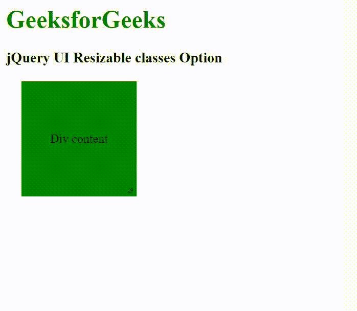

# jQuery 用户界面可调整大小的类选项

> 原文:[https://www . geeksforgeeks . org/jquery-ui-resizable-class-option/](https://www.geeksforgeeks.org/jquery-ui-resizable-classes-option/)

jQuery UI 由 GUI 小部件、视觉效果和使用 jQuery、CSS 和 HTML 实现的主题组成。jQuery 用户界面非常适合为网页构建用户界面。jQuery UI *可调整大小的类*选项用于添加一些额外的 jQuery UI 类。

**语法:**

```html
$(".selector").resizable({
    classes:
     {
        "ui-resizable": "highlight"
     }
});
```

**CDN 链接:**首先，添加项目所需的 jQuery UI 脚本。

> <link rel="”stylesheet”" href="”//code.jquery.com/ui/1.12.1/themes/smoothness/jquery-ui.css”">
> <脚本 src =//code . jquery . com/jquery-1 . 12 . 4 . js "></脚本>
> <脚本 src =//code . jquery . com/ui/1 . 12 . 1/jquery-ui . js "></脚本>

**示例:**

## 超文本标记语言

```html
<!doctype html>
<html lang="en">

<head>
    <meta charset="utf-8">
    <link rel="stylesheet" 
          href=
"//code.jquery.com/ui/1.12.1/themes/smoothness/jquery-ui.css">
    <script src=
"//code.jquery.com/jquery-1.12.4.js">
   </script>
    <script src=
"//code.jquery.com/ui/1.12.1/jquery-ui.js">
    </script>

    <style>
        h1 {
            color: green;
        }

        #first_div {
            width: 150px;
            height: 150px;
            background: green;
            margin: 20px;
            display: flex;
            justify-content: center;
            align-items: center;
            text-align: center;
        }
    </style>
</head>

<body>
    <h1>GeeksforGeeks</h1>

    <h3>jQuery UI Resizable classes Option</h3>
    <div id="first_div">Div content</div>

    <script>
        $(function () {
            $("#first_div").resizable({
                animate: true,
                classes: {
                    "ui-resizable": "highlight"
                }
            });
        });
    </script>
</body>

</html>
```

**输出:**



可调整大小的类

**参考:**T2】https://api.jqueryui.com/resizable/#option-classes