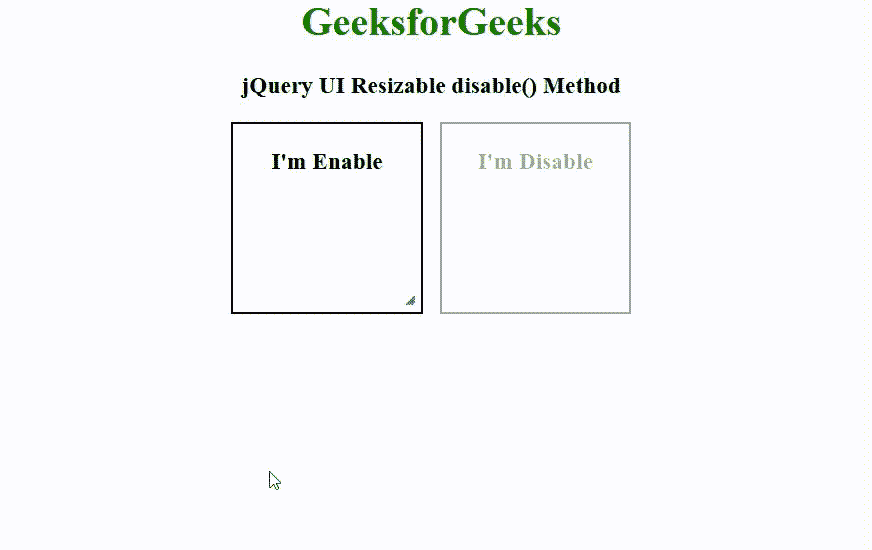

# jQuery UI 可调整大小禁用()方法

> 原文:[https://www . geeksforgeeks . org/jquery-ui-resizable-disable-method/](https://www.geeksforgeeks.org/jquery-ui-resizable-disable-method/)

jQuery 用户界面由图形用户界面小部件、视觉效果和使用 jQuery、CSS 和 HTML 实现的主题组成。jQuery 用户界面非常适合为网页构建用户界面。jQuery UI Resizable disable()方法用于禁用 div 元素的可调整大小属性。此方法不接受任何参数。

**语法:**

```
$( ".selector" ).resizable( "disable" );
```

**CDN 链接:**首先，添加项目所需的 jQuery UI 脚本。

> <link href="”https://code.jquery.com/ui/1.10.4/themes/ui-lightness/jquery-ui.css”rel=”stylesheet”">
> <脚本 src = " https://code . jquery . com/jquery-1 . 10 . 2 . js "></脚本>
> <脚本 src = " https://code . jquery . com/ui/1 . 10 . 4/jquery-ui . js "></脚本>

**示例:**

## 超文本标记语言

```
<!doctype html> 
<html lang="en"> 
   <head> 
      <link href=
"https://code.jquery.com/ui/1.10.4/themes/ui-lightness/jquery-ui.css"
            rel="stylesheet"> 
      <script src=
"https://code.jquery.com/jquery-1.10.2.js">
      </script> 
      <script src=
"https://code.jquery.com/ui/1.10.4/jquery-ui.js">
      </script> 
      <style> 
         h1 {
             color: green;
         }
         .container{
             width: 320px;
         }
         #left-div {
             float: left;
         }
         #right-div{
             float: right;
         }
         #left-div,#right-div
         {
             width: 150px;
             height: 150px;  
             text-align: center;
             border: 2px solid black;
         } 
      </style> 
      <!-- Javascript --> 
      <script> 
         $(function() { 
            $( "#left-div" ).resizable(); 
            $( "#left-div" ).resizable('enable'); 
            $( "#right-div" ).resizable(); 
            $( "#right-div" ).resizable('disable');   
         }); 
      </script> 
   </head> 

   <body>
      <center>
      <h1>GeeksforGeeks</h1>

      <h3>jQuery UI Resizable disable() Method</h3>
      <div class="container"> 
      <div id="left-div">  
         <h3 class="gfg">I'm Enable</h3> 
      </div>
      <div id="right-div">  
         <h3 class="gfg">I'm Disable</h3> 
      </div>
      </div>
      </center>
   </body> 
</html> 
```

**输出:**



**参考:**T2https://api.jqueryui.com/resizable/#method-disable