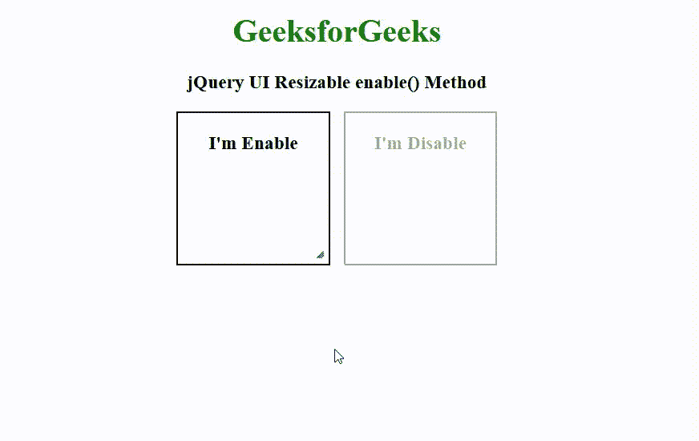

# jQuery UI 可调整大小启用()方法

> 原文:[https://www . geeksforgeeks . org/jquery-ui-resizable-enable-method/](https://www.geeksforgeeks.org/jquery-ui-resizable-enable-method/)

[jQuery UI](https://www.geeksforgeeks.org/jquery-ui-introduction/) 由 GUI 小部件、视觉效果和使用 [jQuery](https://www.geeksforgeeks.org/jquery-tutorials/) 、 [CSS](https://www.geeksforgeeks.org/css-tutorials/) 和 [HTML](https://www.geeksforgeeks.org/html-tutorials/) 实现的主题组成。jQuery 用户界面非常适合为网页构建用户界面。jQuery UI 可调整大小 **enable()** 方法用于启用 HTML [div](https://www.geeksforgeeks.org/div-tag-html/) 元素的*可调整大小*属性。此方法不接受任何参数。

**语法:**

```html
$( ".selector" ).resizable( "enable" );
```

**参数:**此方法不接受任何参数。

**CDN 链接:**首先，添加项目所需的 jQuery UI 脚本。

> <link rel="”stylesheet”" href="”/code.jquery.com/ui/1.12.1/themes/smoothness/jquery-ui.css”">
> <脚本 src = "/code . jquery . com/jquery-1 . 12 . 4 . js "></脚本>
> <脚本 src = "/code . jquery . com/ui/1 . 12 . 1/jquery-ui . js "></脚本>

**示例:**

## 超文本标记语言

```html
<!doctype html>  
<html lang="en">  
   <head>  
      <link href=
"https:/code.jquery.com/ui/1.10.4/themes/ui-lightness/jquery-ui.css" 
            rel="stylesheet">  
      <script src=
"https:/code.jquery.com/jquery-1.10.2.js">
      </script>  
      <script src=
"https:/code.jquery.com/ui/1.10.4/jquery-ui.js">
      </script>  
      <style>  
         h1 {
             color: green;
         }
         .container{
             width: 320px;
         }
         #left-div {
             float: left;
         }
         #right-div{
             float: right;
         }
         #left-div,#right-div 
         { 
             width: 150px; 
             height: 150px;   
             text-align: center; 
             border: 2px solid black;
         }  
      </style>  
      <script>  
         $(function() {  
            $( "#left-div" ).resizable();  
            $( "#left-div" ).resizable('enable');  
            $( "#right-div" ).resizable();  
            $( "#right-div" ).resizable('disable');    
         });  
      </script>  
   </head>  

   <body> 
      <center>
           <h1>GeeksforGeeks</h1>  
           <h3>jQuery UI Resizable enable() Method</h3>
           <div class="container">  
              <div id="left-div">   
                 <h3 class="gfg">I'm Enable</h3>  
              </div>
              <div id="right-div">   
                 <h3 class="gfg">I'm Disable</h3>  
              </div>
           </div>
      </center>
   </body>  
</html>
```

**输出:**



**参考:**T2】https://api.jqueryui.com/resizable/#method-enable