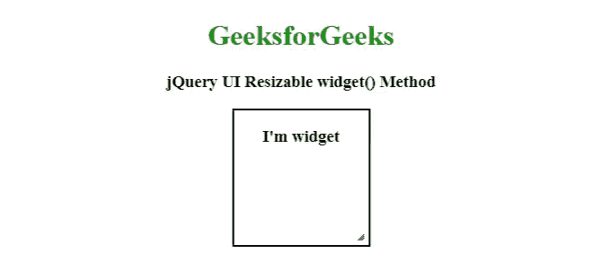
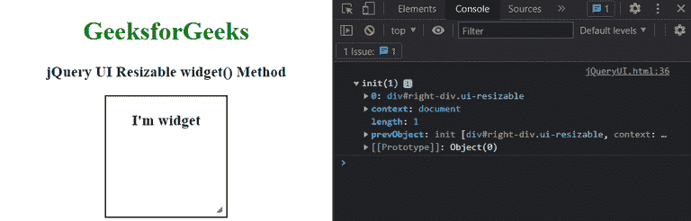

# jQuery UI 可调整大小小部件()方法

> 原文:[https://www . geeksforgeeks . org/jquery-ui-resizable-widget-method/](https://www.geeksforgeeks.org/jquery-ui-resizable-widget-method/)

[jQuery UI](https://www.geeksforgeeks.org/jquery-ui-introduction/) 由 GUI 小部件、视觉效果和使用 [jQuery](https://www.geeksforgeeks.org/jquery-tutorials/) 、 [CSS](https://www.geeksforgeeks.org/css-tutorials/) 和 [HTML](https://www.geeksforgeeks.org/html-tutorials/) 实现的主题组成。 [jQuery UI](https://www.geeksforgeeks.org/jquery-ui-introduction/) 非常适合为网页构建 UI 界面。jQuery UI[Resizable](https://www.geeksforgeeks.org/jquery-ui-resizable/)**widget()**方法用于调用 widget 方法。此方法不接受任何参数。

**语法:**

```
var widget = $( ".selector" ).resizable( "widget" );
```

**参数:**此方法不接受任何参数。

**CDN 链接:**

> <link href="”https:/code.jquery.com/ui/1.10.4/themes/ui-lightness/jquery-ui.css”rel=”stylesheet”">
> <脚本 src = " https://code . jquery . com/jquery-1 . 10 . 2 . js "></脚本>
> <脚本 src = " https://code . jquery . com/ui/1 . 10 . 4/jquery-ui . js "></脚本>

**示例:**

## 超文本标记语言

```
<!doctype html>  
<html lang="en">  
   <head>  
      <link href=
"https:/code.jquery.com/ui/1.10.4/themes/ui-lightness/jquery-ui.css" 
            rel="stylesheet">  
      <script src=
"https:/code.jquery.com/jquery-1.10.2.js">
      </script>  
      <script src=
"https:/code.jquery.com/ui/1.10.4/jquery-ui.js">
      </script>  
      <style>  
         h1 {
             color: green;
         }
         .container{
             width: 170;
         }

         #right-div{
             float: center;
         }
         #left-div,#right-div 
         { 
             width: 150px; 
             height: 150px;   
             text-align: center; 
             border: 2px solid black;
         }  
      </style>  
      <script>  
         $(function() {  
            $( "#right-div" ).resizable();  
            var widget = $( "#right-div" ).resizable('widget');
            console.log(widget)
         });  
      </script>  
   </head>  

   <body> 
      <center>
           <h1>GeeksforGeeks</h1>  
           <h3>jQuery UI Resizable widget() Method</h3>
           <div class="container">  
              <div id="right-div">   
                 <h3 class="gfg">I'm widget</h3>  
              </div>
           </div>
      </center>
   </body>  
</html>  

```

**输出:**

*   **With resizable effect:**

    

*   **控制台中:** 