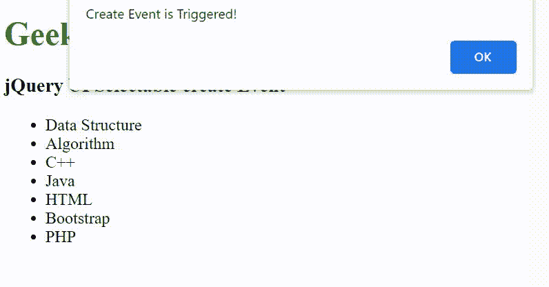

# jQuery 用户界面可选创建事件

> 原文:[https://www . geesforgeks . org/jquery-ui-selected-create-event/](https://www.geeksforgeeks.org/jquery-ui-selectable-create-event/)

jQuery UI 由 GUI 小部件、视觉效果和使用 Query JavaScript 库实现的主题组成。jQuery 用户界面非常适合为网页构建用户界面。它可以用来构建高度交互的 web 应用程序，也可以用来轻松添加小部件。

**jQuery UI 可选创建事件**用于在创建可选时触发。

**语法:**

```
$(".selector").selectable({
    create: function( event, ui ) {}
});
```

**将事件侦听器绑定到 selectablecreate 事件:**

```
$( ".selector" ).on( "selectablecreate", function( event, ui ) {} );
```

**CDN 链接:**首先，添加项目所需的 jQuery UI 脚本。

> <link rel="”stylesheet”" href="”//code.jquery.com/ui/1.12.1/themes/smoothness/jquery-ui.css”">
> <脚本 src =//code . jquery . com/jquery-1 . 12 . 4 . js "></脚本>
> <脚本 src =//code . jquery . com/ui/1 . 12 . 1/jquery-ui . js "></脚本>

**示例:**

## 超文本标记语言

```
<!doctype html>
<html lang="en">

<head>
    <meta charset="utf-8">
    <link rel="stylesheet" href=
"//code.jquery.com/ui/1.12.1/themes/smoothness/jquery-ui.css">
    <script src="//code.jquery.com/jquery-1.12.4.js"></script>
    <script src="//code.jquery.com/ui/1.12.1/jquery-ui.js"></script>

    <style>
        h1 {
            color: green;
        }

        #list .ui-selecting {
            background: greenyellow;
        }

        #list .ui-selected {
            background: green;
        }
    </style>
</head>

<body>
    <h1>GeeksforGeeks</h1>

    <h3>jQuery UI Selectable create Event</h3>

    <ul id="list">
        <li>Data Structure</li>
        <li>Algorithm</li>
        <li>C++</li>
        <li>Java</li>
        <li id="GFG1">HTML</li>
        <li id="GFG2">Bootstrap</li>
        <li>PHP</li>
    </ul>

    <script>
        $("#list").selectable({
            create: function() {
                alert("Create Event is Triggered!")
            }
        });
    </script>
</body>

</html>
```

**输出:**



**参考:**T2】https://api.jqueryui.com/selectable/#event-create