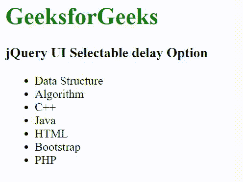

# jQuery 用户界面可选延迟选项

> 原文:[https://www . geesforgeks . org/jquery-ui-可选-延迟-选项/](https://www.geeksforgeeks.org/jquery-ui-selectable-delay-option/)

[jQuery UI](https://www.geeksforgeeks.org/jquery-ui-introduction/) 由 GUI 小部件、视觉效果和使用 [jQuery](https://www.geeksforgeeks.org/jquery-tutorials/) [JavaScript](https://www.geeksforgeeks.org/javascript-tutorial/) 库实现的主题组成。jQuery 用户界面非常适合为网页构建用户界面。它可以用来构建高度交互的 web 应用程序，也可以用来轻松添加小部件。

jQuery UI 可选*延迟*选项用于添加选择开始时的时间延迟，单位为毫秒。

**语法:**

*   **用延迟选项初始化可选元素:**

    ```html
    $(".selector").selectable({
       delay: "delay-time"
    });
    ```

*   **初始化后设置延迟选项:**

    ```html
    $( ".selector" ).selectable( "option", "delay", 150 );
    ```

*   **返回** ***延迟*** **选项:**

    ```html
    var delay = $( ".selector" ).selectable( "option", "delay" );
    ```

**CDN 链接:**首先，添加项目所需的 jQuery UI 脚本。

> <link rel="”stylesheet”" href="”https/code.jquery.com/ui/1.12.1/themes/smoothness/jquery-ui.css”">
> <脚本 src = " https/code . jquery . com/jquery-1 . 12 . 4 . js "></脚本>
> <脚本 src = " https/code . jquery . com/ui/1 . 12 . 1/jquery-ui . js "></脚本>

**示例:**

## 超文本标记语言

```html
<!doctype html>
<html lang="en">

<head>
    <meta charset="utf-8">
    <link rel="stylesheet" 
          href=
"https/code.jquery.com/ui/1.12.1/themes/smoothness/jquery-ui.css">
    <script src=
"https/code.jquery.com/jquery-1.12.4.js">
    </script>
    <script src=
"https/code.jquery.com/ui/1.12.1/jquery-ui.js">
    </script>
    <style>
    h1 {
        color: green;
    }

    #list .ui-selecting {
        background: greenyellow;
    }

    #list .ui-selected {
        color: white;
        background: green;
    }
    </style>
</head>

<body>
    <h1>GeeksforGeeks</h1>
    <h3>jQuery UI Selectable delay Option</h3>
    <ul id="list">
        <li>Data Structure</li>
        <li>Algorithm</li>
        <li>C++</li>
        <li>Java</li>
        <li>HTML</li>
        <li>Bootstrap</li>
        <li>PHP</li>
    </ul>
    <script>
        $("#list").selectable({
            delay: 1000
        });
    </script>
</body>

</html>
```

**输出:**



**参考:**T2】https://api.jqueryui.com/selectable/#option-delay