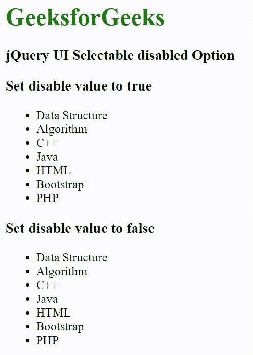

# jQuery 用户界面可选禁用选项

> 原文:[https://www . geesforgeks . org/jquery-ui-可选-禁用-选项/](https://www.geeksforgeeks.org/jquery-ui-selectable-disabled-option/)

[jQuery UI](https://www.geeksforgeeks.org/jquery-ui-introduction/) 由 GUI 小部件、视觉效果和使用 [jQuery](https://www.geeksforgeeks.org/jquery-tutorials/) [JavaScript](https://www.geeksforgeeks.org/javascript-tutorial/) 库实现的主题组成。jQuery 用户界面非常适合为网页构建用户界面。它可以用来构建高度交互的 web 应用程序，也可以用来轻松添加小部件。

jQuery UI [可选](https://www.geeksforgeeks.org/jquery-selectable-and-accordion/) *禁用*选项用于在设置为“*真*时禁用可选元素。

**语法:**

*   **用** ***禁用*** **选项初始化可选元素:**

    ```html
    $(".selector").selectable({
       disabled: Boolean
    });
    ```

*   **初始化后设置或返回** ***禁用*** **选项:**

    ```html
    // Set the disabled option
    $( ".selector" ).selectable( "option", "disabled", Boolean );

    // Return the disabled option
    var disabled = $( ".selector" ).selectable( "option", "disabled" );
    ```

**CDN 链接:**首先，添加项目所需的 jQuery UI 脚本。

> <link rel="”stylesheet”" href="”https/code.jquery.com/ui/1.12.1/themes/smoothness/jquery-ui.css”">
> <脚本 src = " https/code . jquery . com/jquery-1 . 12 . 4 . js "></脚本>
> <脚本 src = " https/code . jquery . com/ui/1 . 12 . 1/jquery-ui . js "></脚本>

**示例:**

## 超文本标记语言

```html
<!doctype html>
<html lang="en">

<head>
    <link rel="stylesheet" 
          href=
"https/code.jquery.com/ui/1.12.1/themes/smoothness/jquery-ui.css">
    <script src=
"https/code.jquery.com/jquery-1.12.4.js">
    </script>
    <script src=
"https/code.jquery.com/ui/1.12.1/jquery-ui.js">
    </script>
    <style>
    h1 {
        color: green;
    }
    /* Styles for list 1 */

    #list1 .ui-selecting {
        background: greenyellow;
    }

    #list1 .ui-selected {
        color: white;
        background: green;
    }
    /* Styles for list 2 */

    #list2 .ui-selecting {
        background: greenyellow;
    }

    #list2 .ui-selected {
        color: white;
        background: green;
    }
    </style>
</head>

<body>
    <h1>GeeksforGeeks</h1>
    <h3>jQuery UI Selectable disabled Option</h3>
    <h3>Set disable value to true</h3>
    <ul id="list1">
        <li>Data Structure</li>
        <li>Algorithm</li>
        <li>C++</li>
        <li>Java</li>
        <li>HTML</li>
        <li>Bootstrap</li>
        <li>PHP</li>
    </ul>
    <h3>Set disable value to false</h3>
    <ul id="list2">
        <li>Data Structure</li>
        <li>Algorithm</li>
        <li>C++</li>
        <li>Java</li>
        <li>HTML</li>
        <li>Bootstrap</li>
        <li>PHP</li>
    </ul>
    <script>
    $("#list1").selectable({
        disabled: true
    });
    $("#list2").selectable({
        disabled: false
    });
    </script>
</body>

</html>
```

**输出:**



**参考:**T2】https://api.jqueryui.com/selectable/#option-disabled